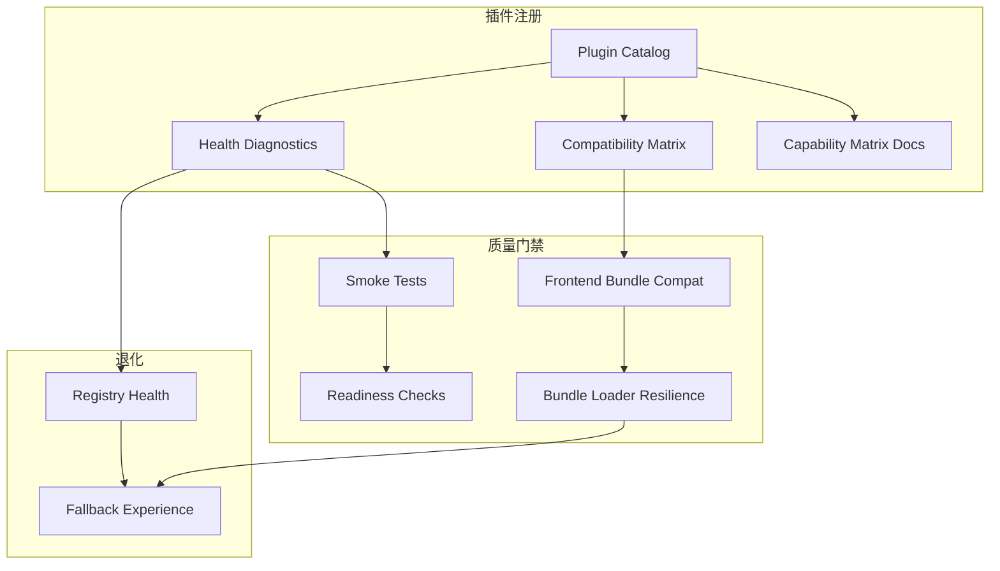

## Why

`c2049` 在定义 official plugins bundles / catalog diagnostics，`c2019` 在定义 plugin health / smoke tests / compat matrix，`c4031` 在定义 docs official plugins capability matrix，`c4061` 在定义 frontend bundle loader resilience / fallback UX。它们本质上都在解决同一个问题：**插件能力现在是否可用、为何不可用、如何自检、如何回退、如何向用户解释**。

如果继续拆开推进，会有三个问题：

- runtime diagnostics、compat matrix、docs matrix 和 bundle fallback 会各自维护一套“插件能力现状”，没有统一真相。
- 用户和开发者会在 API / UI / docs 看到不同的插件命名、状态词汇和修复建议。
- 缺插件、bundle 不兼容、loader 失败这些问题会继续分别被当成运行时 bug、文档问题和前端渲染问题，而不是同一条 plugin capability governance 线。

## Merge Notes

- 合并自 `official-plugins-bundles-and-catalog-diagnostics`
- 合并自 `plugin-health-smoke-tests-and-compat-matrix`
- 合并自 `docs-official-plugins-capability-matrix`
- 合并自 `frontend-bundle-loader-resilience-and-fallback-ux`

## What Changes

- 定义 official plugin catalog substrate：
  - core-only / official-full 交付档位
  - official plugin catalog、loaded/skipped/not_installed 状态、install hints
- 定义 capability provenance substrate（“谁提供了这项能力”）：
  - 对每个可被插件覆盖的 key（provider id / output_type / parser_type / extractor_type / connector_id / slides plugin）统一暴露最终生效 plugin id + entry point
  - 冲突覆盖遵循 last-wins，但必须可诊断：能解释为何是它生效、如何复现与如何固定（load_order/默认选择）
- 定义 plugin health governance：
  - plugin metadata、readiness_check、host smoke tests、compat matrix
  - backend / frontend bundles 的 compat 与 smoke 输出统一收口
- 定义 frontend fallback experience：
  - bundle loader state machine、error classes、fallback UX、manual retry、diagnostics 挂点
- 定义 user-facing explanation chain：
  - API diagnostics、UI capability matrix、docs capability matrix 复用同一命名与状态语义
  - 从“缺了什么”到“怎么修复”是一条闭环

## Capabilities

### New Capabilities

- `official-plugins-bundles-and-catalog-diagnostics`
- `plugin-health-and-compat`
- `plugin-host-smoke-tests-and-readiness-checks`
- `plugin-registry-health-and-compatibility-diagnostics`
- `plugin-frontend-bundle-compat-matrix-and-smoke`
- `docs-official-plugins-capability-matrix`
- `frontend-bundle-loader-resilience`

### Modified Capabilities

- `official-plugins`
- `workspace-api-contract`
- `fullstack-plugin-bundles`
- `output-renderer-unification-and-plugin-bundle-splitting`
- `delivery-and-deployment`

## Impact

- Backend：catalog、diagnostics、smoke tests、compat matrix 与 install hints 会统一收口。
- Frontend：bundle loader、renderer fallback、capability matrix 与 diagnostics UI 会使用同一套状态词汇。
- Docs：官方插件矩阵页不再单独维护另一套术语，而是直接复用 runtime/catalog 真相。
- Migration：默认直接收口到统一 plugin capability governance，不保留多套并行健康矩阵与 fallback 语义。

## Dependency Sketch

