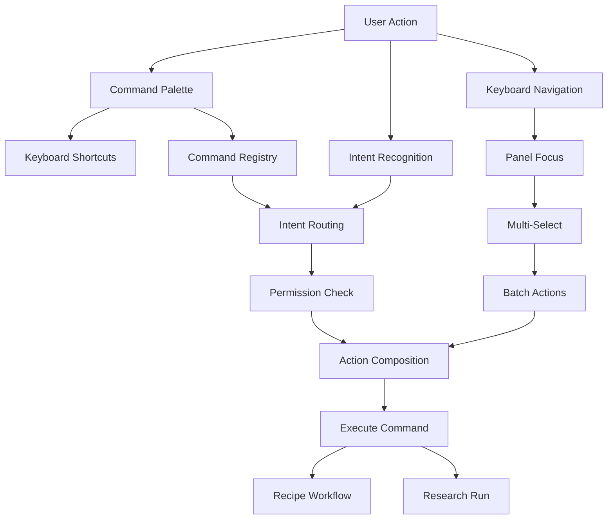

## Why

`c2033` 在定义 command intent routing / permissions / action composition，`c2227` 在定义 command palette / action registry / contextual shortcuts。它们本质上都在建设同一层：**系统动作如何被声明、发现、组合、路由并从 UI 一致触发**。

如果继续拆开推进，会有两个问题：

- command schema 和 command palette 会各自维护“动作是什么、在哪出现、怎么执行”的真相。
- intent routing 如果不和 action registry / palette 一起定义，UI 仍然只能依赖零散按钮和快捷键，无法形成统一动作面。

## Merge Notes

- 合并自 `command-intent-routing-permissions-and-action-composition`
- 合并自 `command-palette-action-surface-and-contextual-shortcuts`
- 合并自 `keyboard-first-panel-navigation-and-multi-select`（含 `batch-actions-for-sources-outputs-and-notes`）

## What Changes

- 定义 unified action / command model：
  - `action_id` / `command_id`、intent、scope、enabled_when、risk_level、side_effects
  - context actions、recent actions、pinned actions、shortcut metadata
- 定义 command routing and composition：
  - UI 发 intent + context
  - registry / router 决定 handler、action composition、preview、failure hints
- 定义 command palette as the canonical action surface：
  - panels / widgets / plugins 统一注册到 registry
  - palette、shortcuts、context menus 和 recommended actions 共用同一动作索引
- 定义键盘优先面板导航与多选（keyboard-first panel navigation & multi-select）：
  - 让用户在主要面板之间稳定移动、聚焦和回退
  - 支持对象多选和范围选择，统一多选状态与焦点状态
  - 多选结果能直接接入命令面板与批量动作
- 定义批处理语义（batch actions）：
  - 覆盖 sources、outputs、notes 与待整理对象的高频批量动作（批量标签、归档、重试、导出、状态变更）
  - 区分安全批处理与高风险批处理，提供预览、差异摘要与确认
  - 批量结果以统一摘要（成功/跳过/失败原因）回写到 UI 与可观测字段
  - 批量接口应能接受幂等键，避免重复操作

## Capabilities

### New Capabilities

- `command-intent-routing-permissions-and-action-composition`
- `command-palette-action-surface`
- `workspace-command-palette-and-shortcuts`
- `keyboard-first-panel-navigation-and-multi-select`
- `batch-actions-for-sources-outputs-and-notes`

### Modified Capabilities

- `workspace-command-registry`
- `workspace-ui-core`
- `workspace-ui-panels`
- `recipe-driven-workflows`
- `agentic-research-runs`
- `cross-panel-selection-and-deep-link-contract`: 扩展到键盘导航与多选状态。
- `workspace-api-contract`: 批量操作接口与结果摘要。

## Impact

- Backend：command routing、preview、composition 与 error mapping 会更可组合。
- Frontend：动作入口、快捷键、palette、selection actions 与推荐动作会建立在同一 registry 上。
- UX：用户更容易找到“能做什么”，也更容易把多个动作串成顺手流程。
- Migration：默认直接收口到统一 action surface，不保留平行的 palette 列表和零散命令定义。

## Dependency Sketch

