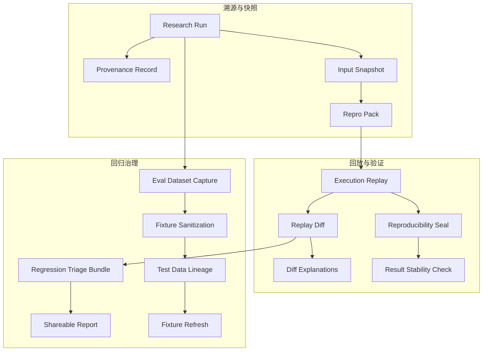

## Why

`c4013` 在定义 provenance / reproducible runs，`c2018` 在定义 repro packs / run input snapshots，`c2035` 在定义 execution trace / replay lab，`c2082` 在定义 real eval capture / replay / sanitization，`c2132` 在定义 reproducibility seals / stability checks，`c2080` 在定义 regression triage bundles / shareable reports。它们本质上都在治理同一条链：**如何把一次执行保存成可读、可回放、可比较、可脱敏分享、可用于回归与稳定性判断的正式证据对象**。

如果继续拆开推进，会有三个问题：

- provenance、repro pack、execution trace、triage bundle 会各自保存“当时发生了什么”，没有统一重放真相。
- replay / eval capture / stability seal 会分别定义输入快照和差异比较边界，导致回归体系重复建模。
- triage report 如果不复用 provenance 和 replay substrate，失败协作仍然要靠额外口头解释。

## Merge Notes

- 合并自 `provenance-and-reproducible-runs`
- 合并自 `repro-packs-and-fixture-pipeline`
- 合并自 `execution-trace-explainability-and-replay-lab`
- 合并自 `real-eval-capture-replay-and-sanitization`
- 合并自 `reproducibility-seals-and-result-stability-checks`
- 合并自 `regression-failure-triage-bundles-and-shareable-reports`

## What Changes

- 定义 provenance substrate：
  - run / artifact / notebook block / chart / table 的统一 provenance package
  - input snapshot、tool/model summary、source citations、generation time
- 定义 replay and explainability：
  - execution trace、explainability summary、checkpoint replay、diff engine
  - replay 区分调试视角、安全视角和对外可见摘要
- 定义 repro and fixture pipeline：
  - repro packs、run input snapshots、sanitized fixtures、real-workspace eval capture
  - capture / sanitization / minimization / lineage / refresh cadence
- 定义 stability and triage：
  - reproducibility seals、result stability checks
  - regression failure triage bundles、shareable reports、baseline exceptions

## Capabilities

### New Capabilities

- `provenance-and-reproducible-runs`
- `repro-packs-and-replay`
- `run-input-snapshots-and-repro-packs`
- `execution-trace-and-replay-lab`
- `real-workspace-eval-dataset-capture-and-replay`
- `fixture-data-sanitization-and-minimization-pipeline`
- `test-data-lineage-and-fixture-refresh-cadence`
- `replay-diff-explanations-and-baseline-exceptions`
- `reproducibility-seals-and-result-stability-checks`
- `regression-failure-triage-bundles-and-shareable-reports`

### Modified Capabilities

- `agentic-research-runs`
- `quality-and-regression`
- `workspace-scenario-fixtures-and-regression-harness`
- `dev-diagnostics-workbench`
- `prompt-regression-slices-and-failure-fingerprints`

## Impact

- Backend：trace store、provenance store、replay planner、diff engine、repro pack/fixture pipeline 与 triage report 都会统一收口。
- Frontend/Admin：时间线、diff、replay、shareable report、stability seal 会建立在同一套 replay/provenance substrate 上。
- Quality：真实工作区 capture、回归夹具、稳定性检查和失败分诊不再是割裂工具链。
- Migration：默认直接收口到统一 provenance/replay/triage foundation，不保留多套平行的复现和报告语义。

## Dependency Sketch

