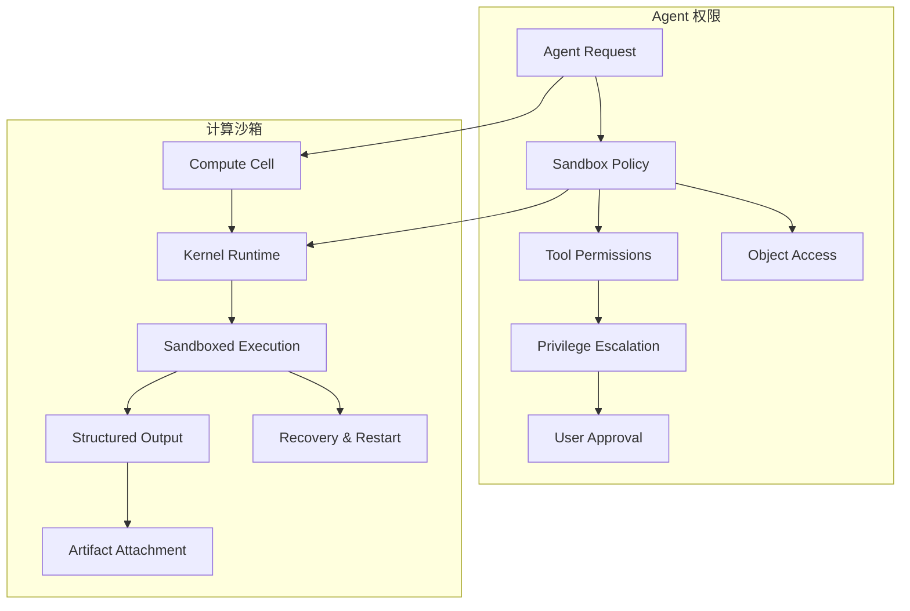

## Why

`c1005` 在定义 agent 工具权限与提权边界，`c2028` 在定义 Notebook compute cell 的沙箱执行语义。两者本质上是同一个执行平面：**什么动作能跑、在什么沙箱里跑、谁批准高风险动作、结果如何被审计和复用**。如果继续拆开推进，工具执行和计算执行会各自长出一套权限、资源和审计模型。

## Merge Notes

- 合并自 `agent-tool-permissions-and-sandbox-policy`
- 合并自 `sandboxed-compute-cells-and-kernel-runtime`

## What Changes

- 定义统一的 agent execution policy model：
  - tool / object / action 三级授权
  - workspace / tenant / environment policy overlay
  - 提权审批后的临时授权 lease
- 定义统一的 sandbox contract：
  - network、filesystem、time、concurrency、resource budget、secret exposure
  - compute cells 与 agent tools 消费同一套策略，而不是各自维护独立配置
- 定义 compute cell runtime contract：
  - compute cell 通过后台任务运行时进入排队、恢复、取消和审计链路
  - 输出结果以 block / table / chart / artifact ref 的形式回挂到 Notebook
- **BREAKING**：执行策略直接收口到统一 execution policy，不保留“工具权限配置”和“计算沙箱配置”两套平行真相

## Capabilities

### New Capabilities

- `agent-tool-permissions-and-sandbox-policy`: 定义 agent tool、对象访问、提权和沙箱边界的统一授权模型
- `sandboxed-compute-cells-and-kernel-runtime`: 定义 compute cell 的执行、恢复、输出挂接和沙箱消费语义

### Modified Capabilities

- `background-jobs-and-task-runtime`: 增加 compute-class job 的资源 profile、sandbox lease 与结构化产物语义

## Impact

- Backend：需要统一权限求值、提权审批接入、沙箱 profile 装配、compute executor 与产物持久化契约
- Frontend：需要 compute cell、风险提示、提权流程、执行状态和结构化输出视图
- Product：Notebook、Agent、后台任务三条链路会共享同一执行治理底座
- Migration：直接升级到 unified execution policy，不再保留分散的旧式执行开关

## Dependency Sketch

