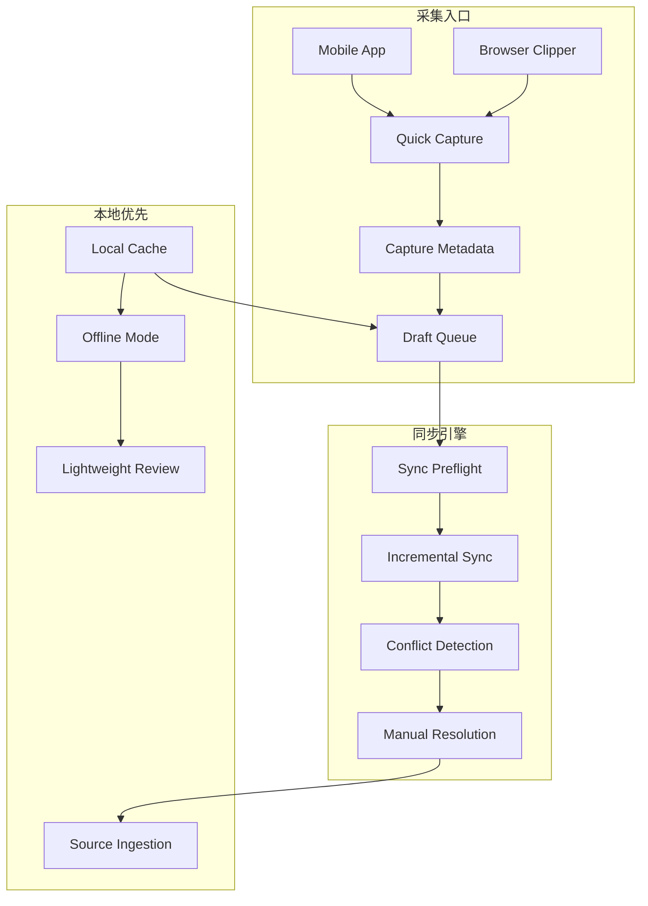

## Why

`c2013`、`c4018` 在补手机与浏览器两个高频轻入口，`c2031`、`c2073` 在定义 local-first sync、冲突处理和同步预检。它们本质上是同一条链路：**用户在任意轻入口先采集/编辑，本地排队，再按统一规则同步、冲突决议和恢复**。如果拆开推进，移动端、浏览器扩展和 Notebook 编辑会各自维护一套本地缓存、同步提示和冲突语义。

## Merge Notes

- 合并自 `mobile-capture-and-review-mode`
- 合并自 `local-first-offline-sync-and-conflict-resolution`
- 合并自 `local-cache-draft-queue-and-sync-preflight`
- 合并自 `browser-clipper-and-web-capture`

## What Changes

- 定义统一的 lightweight capture model，覆盖 mobile capture、browser clipper、URL quick import、selection/screenshot capture 与延后归档入口。
- 定义 local-first object cache 与 draft queue，让轻入口采集、Notebook 编辑和轻量审阅都先本地落地，再异步同步。
- 定义 sync preflight contract：
  - 同步前检查冲突风险、依赖缺口、对象缺失和潜在覆盖
  - 结果分为 silent sync / confirm required / blocked 三类
- 定义 block-level conflict resolution：
  - Notebook block、capture draft 和 review actions 使用统一冲突分类
  - 必要时进入人工决议或 review path，而不是静默覆盖
- 定义 capture normalization：
  - 浏览器网页采集、移动分享导入和轻量文件接入统一落到正式 source / draft object 链路
  - 保留 capture metadata、清洗档位与最小 provenance 摘要，支撑后续同步和引用
- **BREAKING**：轻入口采集与离线编辑直接收口到统一 local-first queue / sync model，不保留“移动端临时草稿”“扩展端独立缓存”“编辑器独立待同步状态”三套平行机制

## Capabilities

### New Capabilities

- `mobile-capture-and-review`: 定义 mobile-first capture、轻量审阅与小屏同步反馈语义
- `browser-clipper-and-web-capture`: 定义浏览器整页/选区/截图采集、capture metadata 与延后落地语义
- `local-first-offline-sync-and-conflict-resolution`: 定义多端本地缓存、增量同步、冲突检测与人工决议边界
- `local-cache-draft-queue-and-sync-preflight`: 定义统一 draft queue、同步预检与确认分类

### Modified Capabilities

- `workspace-ui-core`: 需要在小屏与离线场景下提供统一 capture/sync 状态入口
- `workspace-api-contract`: 需要提供 capture ingest、sync preflight、conflict summary 与队列回放的稳定接口语义
- `source-ingestion-upload-and-url`: 需要支持轻入口 capture object、capture metadata 与延后落地流程

## Impact

- Frontend：需要移动壳层、扩展入口、本地缓存、队列状态、预检提示和冲突处理交互
- Backend/API：需要 capture ingest、sync cursor、preflight summary、conflict detection 和 replay contract
- Product：这会把“随手采集”和“离线可用”收敛成一条可信主路径，而不是多个入口各自凑合
- Migration：直接升级到 unified local-first queue/sync model，不保留分散的旧式入口缓存语义

## Dependency Sketch

