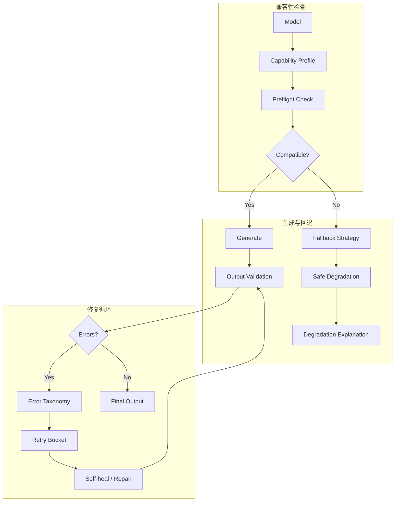

## Why

`c2218` 在搭 typed generation 的公共控制面，`c2065` 在补模型能力画像与生成前兼容性预检，`c2068`、`c2071`、`c1014` 则分别补降级、重试分类和输出修补。它们其实都在解决同一件事：**一次生成请求在真正调用模型前如何判断能不能做，做坏了之后如何解释、回退、重试或修补，而不是直接失败或偷偷变味**。

## Merge Notes

- 合并自 `output-validation-repair-and-self-heal`
- 合并自 `model-capability-profiles-and-output-compatibility`
- 合并自 `generation-fallback-strategies-and-safe-degradation`
- 合并自 `structured-generation-retry-buckets-and-error-taxonomy`
- 合并自 `typed-generation-framework-minimal-contract`

## What Changes

- 把 typed generation framework 扩展为统一 generation governance control plane：
  - generation type 定义输入要求、输出 contract、完成语义和 recovery hooks
  - output type 只负责承载与渲染，不再反向定义生成控制逻辑
- 定义 model capability profiles + output compatibility：
  - 在生成前检查模型能力、输出 schema、上下文结构和最小输入是否兼容
  - 结果区分 hard block、soft warning、fallback-eligible
- 定义 structured generation retry buckets and error taxonomy：
  - 将失败分到 schema、parse、model capability、context insufficiency、postprocess 等稳定 bucket
  - 不同 bucket 绑定不同 retry / fallback / repair 策略
- 定义 safe degradation：
  - 只在 generation type 明确允许的边界内降级
  - 降级必须解释丢失了什么能力、保留了什么能力，并回挂到结果状态
- 定义 output validation repair and self-heal：
  - 对结构不完整但可修的结果执行可见、可回退的轻量修补
  - 区分 auto-repair、confirm-before-repair、must-rerun
- **BREAKING**：生成入口直接收口到统一的 compatibility → fallback/retry → repair loop，不保留“某些输出类型各自私有预检/重试/修补逻辑”的平行机制

## Capabilities

### New Capabilities

- `model-capability-profiles-and-output-compatibility`: 定义模型能力画像、生成兼容性和预检边界
- `generation-fallback-strategies-and-safe-degradation`: 定义回退路径、降级解释与结果标记
- `structured-generation-retry-buckets-and-error-taxonomy`: 定义错误分类、重试桶和策略语义
- `output-validation-repair-and-self-heal`: 定义输出修补、自愈边界、差异与回退语义

### Modified Capabilities

- `typed-generation-framework`: 需要把兼容性、降级、修补和完成语义挂到统一 generation type contract
- `generation-core`: 需要接入 preflight、bucketed recovery decision 和 post-generation validation loop
- `config-and-models`: 需要表达模型 capability profile 与兼容性提示
- `workspace-ui-core`: 需要在生成入口和结果页给出兼容性、降级、重试与修补解释

## Impact

- Backend：会影响 generation routing、preflight evaluator、error taxonomy、fallback planner 和 repair pipeline
- Frontend：会影响生成入口预警、降级说明、重试建议、修补入口和结果状态展示
- Product：这会把“运气好生成成功”升级成“有契约的生成治理闭环”
- Migration：直接升级到统一 typed generation governance，不保留输出类型私有的旧式 recovery 逻辑

## Dependency Sketch

