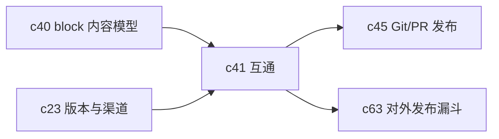

## Why

Notebook 如果只能待在 Crystalith 里，它的价值就很难真正外溢。团队最后一定会问三件事：能不能导成 Markdown 发 PR，能不能接到 Jupyter 继续算，能不能带着引用和版本信息稳定导出。现在不把互通定成正式提案，后面每条发布链路都会各搞一套转换。

## What Changes

- 定义 Notebook 与 Markdown、Jupyter、PDF/Slides 等主要形态之间的导入导出契约。
- 导出结果默认携带来源清单、引用信息、版本摘要和可选的 provenance 元数据。
- 导入流程需要给出映射报告，明确哪些内容能保真，哪些内容会降级成通用块。
- 让 Notebook 不只是工作区内部对象，而是可交换、可归档、可二次加工的产物。

## Capabilities

### New Capabilities

- `notebook-import-export-interoperability`: 定义 Notebook 的导入、导出和降级映射语义。

### Modified Capabilities

- `publish-and-share-knowledge-packs`: 需要支持把 Notebook 作为正式发布源。
- `artifact-versioning-and-release-channels`: 需要支持导出格式与版本语义绑定。
- `multimodal-audio-video-briefings`: 后续音视频简报需要稳定消费 Notebook 内容。
- `provenance-and-reproducible-runs`: 导出和回放需要共享同一份输入摘要。

## Impact

- Backend：需要统一导出装配、格式转换和导入映射报告。
- Frontend：需要补导入预览、导出选项和保真度提示。
- Product：这条线会直接影响 PR 发布、对外分享和公开文档资产。

## Dependency Sketch

