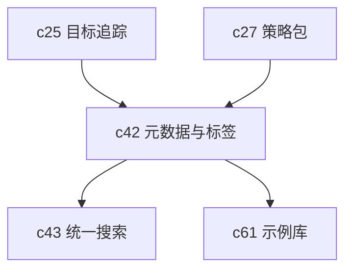

## Why

工作区一多，真正先坏掉的通常不是生成，而是“找不到”。哪个 Notebook 还有效，哪个产物已经过期，哪个来源属于哪个目标，谁审批过什么，如果这些信息继续散在页面标题、描述和人工习惯里，后面再补搜索和推荐也会很虚。

## What Changes

- 为 workspace、notebook、artifact、source 引入统一元数据层，至少覆盖标签、owner、领域、敏感级别、有效期和关联目标。
- 定义可继承、可覆盖的 tagging 规则，让来源、产物、模板之间能共享同一组发现语义。
- 让元数据进入列表、过滤、推荐和治理链路，而不是只停在详情页展示。
- 为后续搜索、样板库、公开发布和策略控制提供一套共同索引面。

## Capabilities

### New Capabilities

- `workspace-metadata-tags-and-discovery`: 定义工作区对象的元数据、标签和发现语义。

### Modified Capabilities

- `workspace-api-contract`: 需要统一暴露标签、owner 和有效期等元数据字段。
- `outcome-goals-and-impact-tracking`: 目标需要能挂接到 Notebook、artifact 和 workflow。
- `policy-packs-and-environment-promotion`: 策略判断需要消费元数据，而不是只看环境。
- `example-gallery-and-sample-workspaces`: 样板库需要靠统一标签体系组织。

## Impact

- Backend：需要补元数据存储、索引和继承规则。
- Frontend：需要补标签管理、过滤器和对象发现视图。
- Product：这是 `c43` 搜索、`c61` 样板库和 `c63` 公开入口的前置整理工作。

## Dependency Sketch

