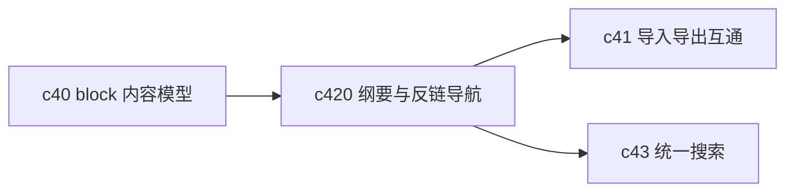

## Why

Notebook 一旦开始变长，最先暴露的问题不是编辑器不够花，而是找不到结构。段落、引用、输出块、研究结论都堆在一起以后，如果没有纲要、反链和结构导航，Notebook 很快就只剩滚动。

## What Changes

- 增加 notebook outline，把标题、块级结构、关键引用点和输出块收成稳定导航树。
- 定义 backlinks，让块、结论、来源和其他 notebook 之间的回指关系变成正式对象。
- 支持结构级跳转、折叠、聚焦和“回到上次编辑位置”，减少长文档中的迷路感。
- 让结构导航既服务写作，也服务审阅、搜索命中和多 notebook 复用。

## Capabilities

### New Capabilities
- `notebook-outline-backlinks-and-structural-navigation`: 定义 Notebook 纲要、反链和结构导航语义。

### Modified Capabilities
- `workspace-ui-core`: 需要补结构导航壳层、聚焦态和回链体验。
- `workspace-ui-panels`: 面板与 Notebook 之间需要支持结构级落点。
- `multi-notebook-collections`: 反链关系需要能跨 notebook 复用。
- `workspace-api-contract`: 需要提供 outline、backlink 和结构级定位接口。

## Impact

- Backend：会影响 block 索引、结构树查询、反链关系存储和导航接口。
- Frontend：会影响 Notebook 主视图、侧边栏、引用跳转和搜索结果落点。
- Dependencies：这条线建立在 `c40-notebook-content-model-and-block-editor` 之上，也会继续推高 `c41`、`c43` 的价值。

