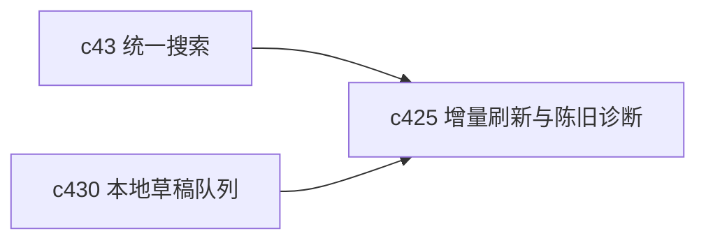

## Why

统一搜索的难点不只在查询，还在索引什么时候更新、为什么还没更新、现在这条结果是不是旧的。没有这一层，搜索结果一旦和最新内容不一致，用户很快就会不信它。

## What Changes

- 定义搜索索引的增量刷新语义，明确 source、notebook、block、output 各自的刷新触发点。
- 增加 staleness diagnostics，让用户和系统都看得见“这条结果为什么可能是旧的”。
- 区分同步刷新、异步刷新和延迟可见，避免所有内容都走最重路径。
- 让搜索结果能回指其索引时间、来源快照和最近变更来源，方便排错和复盘。

## Capabilities

### New Capabilities
- `search-index-incremental-refresh-and-staleness-diagnostics`: 定义索引增量更新、陈旧诊断和可见性边界。

### Modified Capabilities
- `retrieval-and-cache`: 需要增加索引刷新策略和陈旧信号。
- `workspace-api-contract`: 搜索接口需要暴露索引时间、陈旧原因和刷新状态。
- `knowledge-curation-and-freshness`: 来源新鲜度需要能传导到搜索诊断。
- `source-ingestion-core`: 来源变更需要稳定触发索引刷新。

## Impact

- Backend：会影响索引构建、刷新队列、元数据字段和诊断接口。
- Frontend：会影响搜索结果说明、刷新提示和诊断视图。
- Dependencies：这条线是 `c43-unified-search-query-and-rerank` 的补完项，也会和 `c430` 的本地草稿同步前检查互相咬合。

