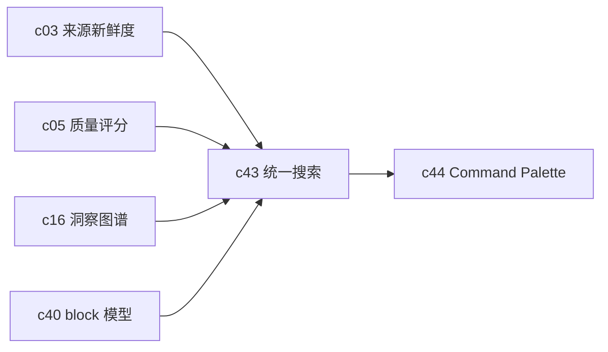

## Why

现在来源、Notebook、输出、模板都在长，但检索入口还没有正式收口。用户一旦开始积累内容，产品体验很快会被一句话定义：搜得到还是搜不到。没有统一搜索，前面做的 readiness、质量、图谱和模板都很难真正复利。

## What Changes

- 为 sources、chunks、notebooks、artifacts、templates 提供统一搜索入口和统一结果模型。
- 引入 rerank、过滤和结果解释，让搜索不只是“列出命中项”，而是能说明为什么排在前面。
- 支持按标签、时间、新鲜度、可信度、状态等信号组合筛选。
- 搜索结果要能稳定跳到具体 block、来源片段或产物节点。

## Capabilities

### New Capabilities

- `unified-search-query-and-rerank`: 定义工作区内统一检索、排序和结果跳转语义。

### Modified Capabilities

- `source-readiness-and-freshness-hub`: 搜索需要消费来源健康和新鲜度信号。
- `workspace-eval-center`: 质量信号需要能影响排序和过滤。
- `cross-notebook-insight-graph`: 图谱关系可以作为 rerank 的辅助因子。
- `notebook-content-model-and-block-editor`: 结果跳转需要落到具体 block。

## Impact

- Backend：需要统一查询面、索引策略和 rerank 装配。
- Frontend：需要新建全局搜索入口、结果页和 block 级跳转体验。
- Product：这是把内容积累真正变成资产的关键一步。

## Dependency Sketch

