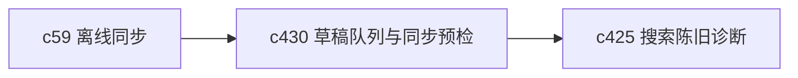

## Why

离线和本地优先不是一句口号，真正难的是用户改完东西准备同步时，系统能不能先告诉他这次同步大概会发生什么。没有同步前检查，本地草稿队列只会在出错时才被注意到。

## What Changes

- 定义 local draft queue，把本地新增、修改、待确认和待同步对象收成统一队列。
- 增加 sync preflight，在真正提交同步前先检查冲突风险、依赖缺口、对象缺失和潜在覆盖。
- 区分“可以静默同步”“需要用户确认”“不允许直接同步”三类结果，减少事后修复。
- 让本地草稿队列既能服务 Notebook 编辑，也能服务输出草稿、来源补录和轻入口操作。

## Capabilities

### New Capabilities
- `local-cache-draft-queue-and-sync-preflight`: 定义本地草稿队列、同步前检查和确认边界。

### Modified Capabilities
- `workspace-shared-ui-state`: 需要承接本地草稿、同步状态和确认结果。
- `workspace-ui-core`: 需要补同步预检提示、队列入口和风险确认。
- `workspace-api-contract`: 需要支持预检、冲突摘要和队列回放接口.
- `data-and-storage`: 需要明确本地草稿与服务端对象的映射边界。

## Impact

- Frontend：会影响本地缓存、编辑状态、同步提示和草稿入口。
- Backend/API：会影响预检接口、冲突判断和对象映射规则。
- Dependencies：这条线是 `c59-local-first-offline-sync-and-conflict-resolution` 的前置补件，也会给 `c425` 搜索陈旧诊断提供更准确的本地态信息。

