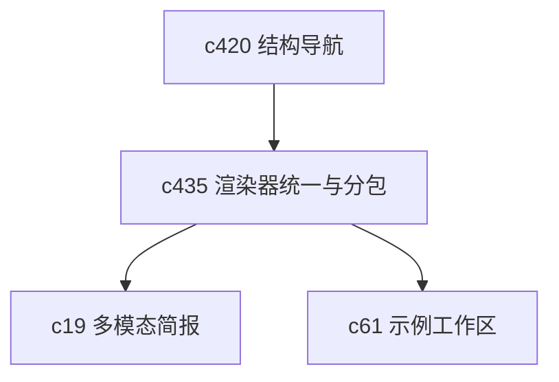

## Why

输出类型越来越多以后，前端最容易变乱的地方就是 renderer。现在已经有多种 output viewer、官方插件和 bundle 入口，但它们之间的装配方式还不够统一。继续往上长，维护成本会越来越高。

## What Changes

- 收口 output renderer 的宿主契约，让官方输出和插件输出共享同一套最小装配面。
- 明确 renderer bundle splitting 策略，避免低频输出把高频主路径一起拖重。
- 统一 renderer 的错误兜底、加载态和 capability 检测，不再每种输出自己兜。
- 为后续新增输出类型保留更清晰的扩展边界，减少前端侧“加一个类型改很多处”的情况。

## Capabilities

### New Capabilities
- `output-renderer-unification-and-plugin-bundle-splitting`: 定义输出渲染宿主契约、插件装配和分包边界。

### Modified Capabilities
- `output-rendering-and-typing`: 需要统一 renderer 输入载荷与宿主行为。
- `studio-output-types`: 各输出类型需要遵守统一渲染契约。
- `fullstack-plugin-bundles`: 需要补输出渲染相关 bundle 拆分与加载边界。
- `official-plugins`: 官方插件目录需要表达渲染能力和分包信息。

## Impact

- Frontend：会影响 output viewer、插件注册、按需加载和错误兜底。
- Backend/API：主要影响输出载荷的一致性要求。
- Dependencies：这条线承接 `c420` 的结构导航，也会让 `c19`、`c61` 这类后续扩展更轻一点。

