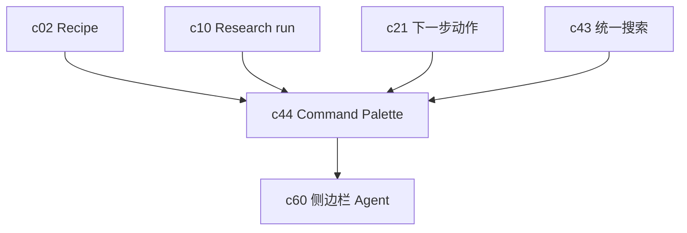

## Why

能力一多，路径就会变长。用户不会记得每个入口在哪个面板里，但会记得“我想做这件事时，是不是还得找半天”。Command Palette 不是装饰，它是让复杂工作区保持可操作密度的一种收口方式。

## What Changes

- 引入统一的 Command Palette，覆盖打开对象、执行 recipe、触发 run、导出和发起审阅等高频动作。
- 把 `c21` 的推荐动作和 `c02` 的 recipe 编排收敛到同一个可搜索入口里。
- 支持轻量快捷脚本，让常见的 3 到 5 步动作可以封装成一个命令。
- 让命令权限、上下文和可见性与 workspace 对象状态对齐，而不是做成一套平行菜单。

## Capabilities

### New Capabilities

- `workspace-command-palette-and-shortcuts`: 定义全局命令入口、快捷动作和上下文可见性。

### Modified Capabilities

- `recipe-driven-workflows`: recipe 需要以命令方式被发现和触发。
- `agentic-research-runs`: run 的启动、暂停、恢复需要有统一入口。
- `proactive-recommendations-and-next-best-actions`: 推荐动作需要能一键执行。
- `workspace-command-registry`: 需要升级为对 UI 和 agent 都可消费的命令索引。

## Impact

- Backend：需要统一命令注册、权限过滤和上下文装配。
- Frontend：需要补全局弹层、快捷键、命令搜索和最近动作。
- Product：这条线会直接改善“功能很多，但不顺手”的问题。

## Dependency Sketch

