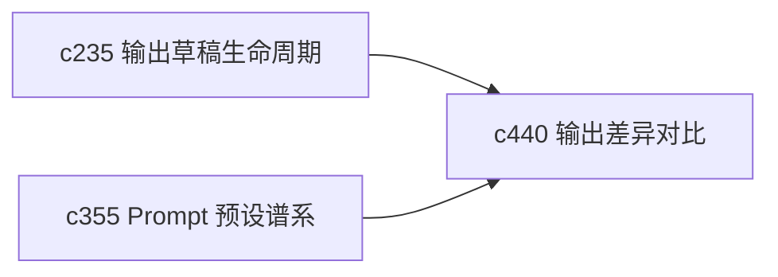

## Why

用户只要开始认真比较结果，就不会满足于“看两个版本”。他们会想知道哪里变了、为什么变、是引用变了还是结构变了。没有差异对比和版本复核，输出很难成为真正可审的对象。

## What Changes

- 定义 output diff view，支持结构差异、文本差异和引用差异的并行对比。
- 增加 version review 语义，让用户能把某次变更当成一个待确认差异来看，而不是只能直接替换。
- 支持把模型变化、preset 变化和上下文变化作为差异背景一起展示。
- 让对比结果能回指草稿生命周期，而不是变成独立的一次性弹窗。

## Capabilities

### New Capabilities
- `output-diff-compare-and-version-review`: 定义输出差异对比、版本复核和变更背景语义。

### Modified Capabilities
- `output-draft-lifecycle-and-regeneration-safety`: 草稿状态需要支持进入差异复核。
- `publishable-artifacts`: 正式产物需要能展示与上一版本的差异摘要。
- `output-rendering-and-typing`: 输出载荷需要表达可比较结构与差异锚点。

## Impact

- Backend：会影响差异计算、版本关系和对比接口。
- Frontend：会影响输出查看器、版本对比页和确认入口。
- Dependencies：这条线接在 `c235` 和 `c355` 后面，既依赖草稿语义，也依赖预设背景。

