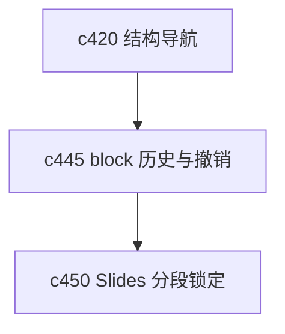

## Why

Notebook 只要开始变成正式工作对象，用户迟早会犯两种错：改过头，或者改错地方。没有块级历史和撤销检查点，长文档编辑迟早会变得让人不敢动。

## What Changes

- 定义 block history，记录块级增删改的轻量历史，不要求每次都做完整版本。
- 增加 undo checkpoint，让用户在关键整理动作前后能安全回退。
- 区分局部撤销和结构级回退，避免为了改一段文字把整个 notebook 回滚。
- 让历史和撤销信息可以被结构导航、差异对比和离线同步共同消费。

## Capabilities

### New Capabilities
- `notebook-block-history-and-undo-checkpoints`: 定义块级历史、撤销检查点和局部回退语义。

### Modified Capabilities
- `notebook-content-model-and-block-editor`: 需要支持块级历史和检查点。
- `local-first-offline-sync-and-conflict-resolution`: 本地修改与撤销需要共享对象边界。
- `workspace-api-contract`: 需要增加块历史和回退动作接口。

## Impact

- Backend：会影响 block 变更记录、检查点存储和回退逻辑。
- Frontend：会影响编辑器、撤销入口和历史查看。
- Dependencies：这条线会承接 `c420` 的结构导航，也会给 `c450` 的分段锁定提供更稳的编辑基础。

