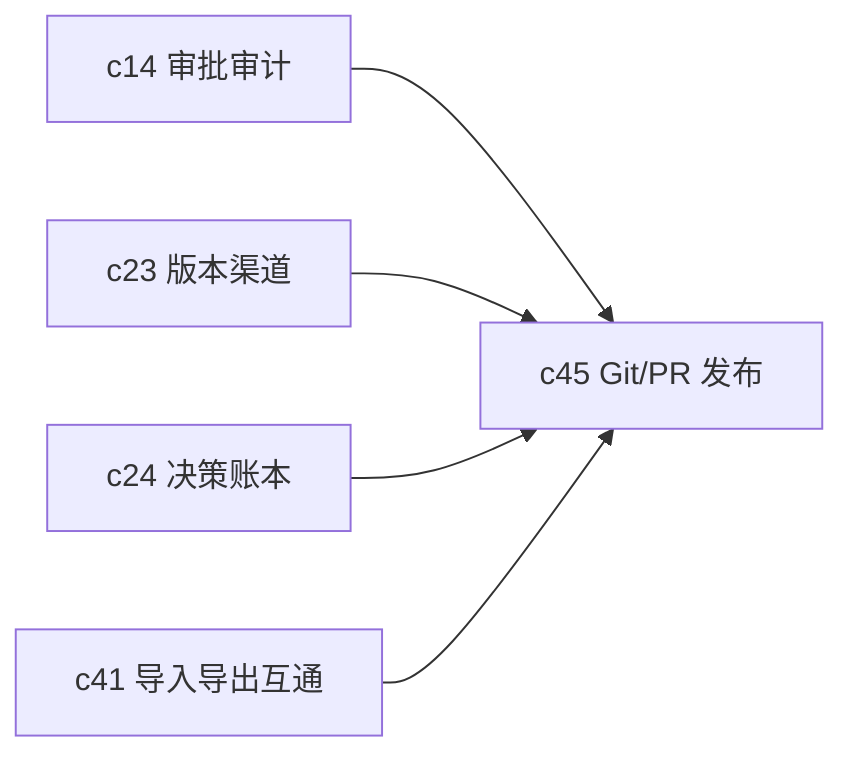

## Why

很多团队真正的审阅、批准和对外交付，不是在应用内部完成，而是在 Git 和 PR 里完成。如果 Crystalith 的正式产物不能接进这条路径，后面的审批、版本、复盘就会一直像“系统内有一套，团队习惯里又有一套”。

## What Changes

- 支持把选定 Notebook、knowledge pack、briefing 等产物同步为 Git 目录结构，而不是只导出一个静态文件。
- 支持 PR-based publishing：生成变更摘要、引用清单、风险提示和待审事项。
- 把 PR 评论和最终合并结果回写到审阅记忆和版本渠道中。
- 让 Git 成为正式发布链路的一等目标，而不是外围导出选项。

## Capabilities

### New Capabilities

- `git-sync-and-pr-based-publishing`: 定义产物到 Git 的同步、PR 审阅和回写语义。

### Modified Capabilities

- `artifact-versioning-and-release-channels`: 需要把 PR 合并视为正式发布事件。
- `review-memory-and-decision-ledger`: 需要吸收 PR 评论和合并结论。
- `approval-flows-and-audit-trails`: 需要支持外部审阅节点。
- `developer-api-and-webhook-automation`: 需要支持 Git 同步触发和状态回调。

## Impact

- Backend：需要补同步编排、差异摘要和回写钩子。
- Frontend：需要补 Git 目标配置、PR 状态展示和冲突提示。
- Product：这条线会显著降低团队把 Crystalith 结果纳入现有流程的阻力。

## Dependency Sketch

