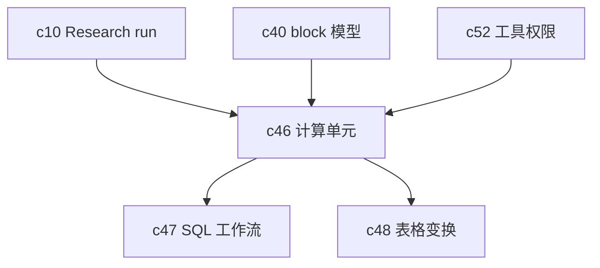

## Why

目前工作流对“研究和生成”已经比较完整，但一旦碰到结构化清洗、统计、对比、简单脚本处理，用户还是得跳回 Jupyter、SQL IDE 或别的工具。少了计算单元，Notebook 很难真正成为工作的主场。

## What Changes

- 为 Notebook 引入可执行 compute cell，先定义运行语义、资源边界和产物挂接方式。
- 让 compute cell 通过任务运行时进入可排队、可恢复、可审计的执行链路。
- 运行结果需要能作为 block、表格或图表继续被引用，而不是一次性文本输出。
- 默认采用沙箱模型，先把权限和资源边界定清楚，再考虑扩展语言种类。

## Capabilities

### New Capabilities

- `sandboxed-compute-cells-and-kernel-runtime`: 定义计算单元、沙箱执行和结果挂接语义。

### Modified Capabilities

- `background-jobs-and-task-runtime`: 需要支持更长生命周期和资源受控的计算任务。
- `agentic-research-runs`: run 内需要能编排计算节点，而不只是搜索和生成节点。
- `notebook-content-model-and-block-editor`: 计算单元要成为正式 block 类型。
- `agent-tool-permissions-and-sandbox-policy`: 需要为执行环境定义工具和资源策略。

## Impact

- Backend：需要计算执行器、资源限制、结果持久化和失败恢复逻辑。
- Frontend：需要 compute cell、执行状态、输出视图和错误恢复体验。
- Product：这是把 Notebook 从“文档型工作区”推向“可计算工作区”的关键提案。

## Dependency Sketch

