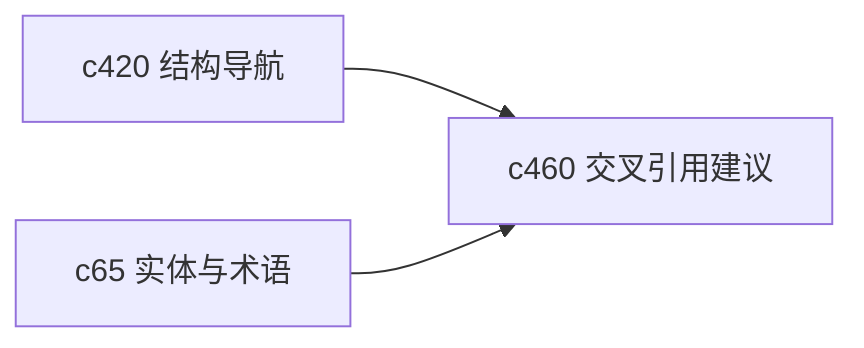

## Why

Notebook 多了以后，最可惜的不是写重复内容，而是明明有关联却没连起来。用户不一定总能记得某个概念之前在哪本里提过。没有轻量的交叉引用建议，复用会一直靠记忆。

## What Changes

- 定义 cross-reference suggestion，根据实体、标题、引用和上下文为 notebook 提供链接建议。
- 支持 link inference，让系统推断出潜在的块到块、笔记到笔记关联，但不自动写入正文。
- 区分强建议和弱建议，避免把噪声关系堆给用户。
- 让建议结果既能服务写作，也能服务结构导航和搜索增强。

## Capabilities

### New Capabilities
- `notebook-cross-reference-suggestions-and-link-inference`: 定义交叉引用建议、链接推断和确认边界。

### Modified Capabilities
- `notebook-outline-backlinks-and-structural-navigation`: 需要接收新建反链与建议关系。
- `canonical-entities-glossary-and-semantic-resolution`: 实体归一信息需要参与建议生成。
- `unified-search-query-and-rerank`: 搜索可以把确认过的引用关系作为增强信号。

## Impact

- Backend：会影响关系推断、建议生成和关联存储。
- Frontend：会影响 Notebook 编辑器、边栏建议和确认交互。
- Dependencies：这条线是 `c420` 的自然延展，也会和 `c65` 互相抬高价值。

