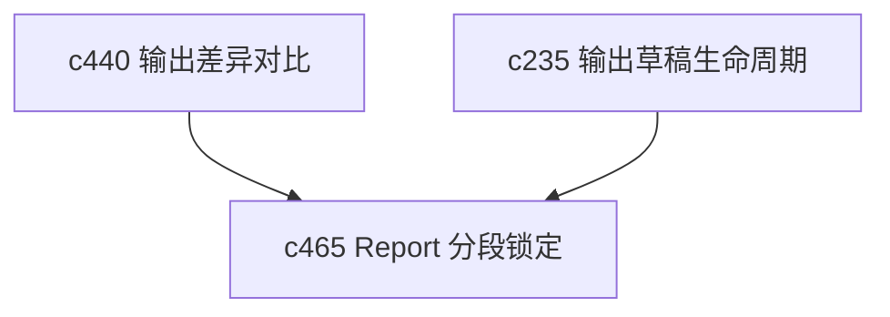

## Why

Slides 不是唯一会遇到“只想改一段”的输出。Report、guide、briefing 一旦开始认真修，也会碰到同样的问题。没有分段锁定和增量重生成，长报告会越来越难半自动维护。

## What Changes

- 定义 report section locking，让用户能锁定已确认段落或章节。
- 支持 incremental regeneration，只在指定章节内重写，而不是全量覆盖整个输出。
- 区分结构稳定、引用稳定和文案稳定三类锁定范围，避免一把锁太粗。
- 让 section 级差异预览成为正式动作，而不是“先生成了再手工比”。

## Capabilities

### New Capabilities
- `report-section-locking-and-incremental-regeneration`: 定义报告分段锁定、增量重生成和段级差异语义。

### Modified Capabilities
- `output-draft-lifecycle-and-regeneration-safety`: 需要细化到 section 粒度。
- `output-diff-compare-and-version-review`: 需要支持 section 级差异展示。
- `studio-output-types`: guide、briefing、report 类输出需要共享这一套能力边界。

## Impact

- Backend：会影响输出分段结构、局部生成和锁定元数据。
- Frontend：会影响输出编辑、章节列表、锁定标记和差异预览。
- Dependencies：这条线和 `c450` 平行，但覆盖的是文字型长输出，不是 slides。

