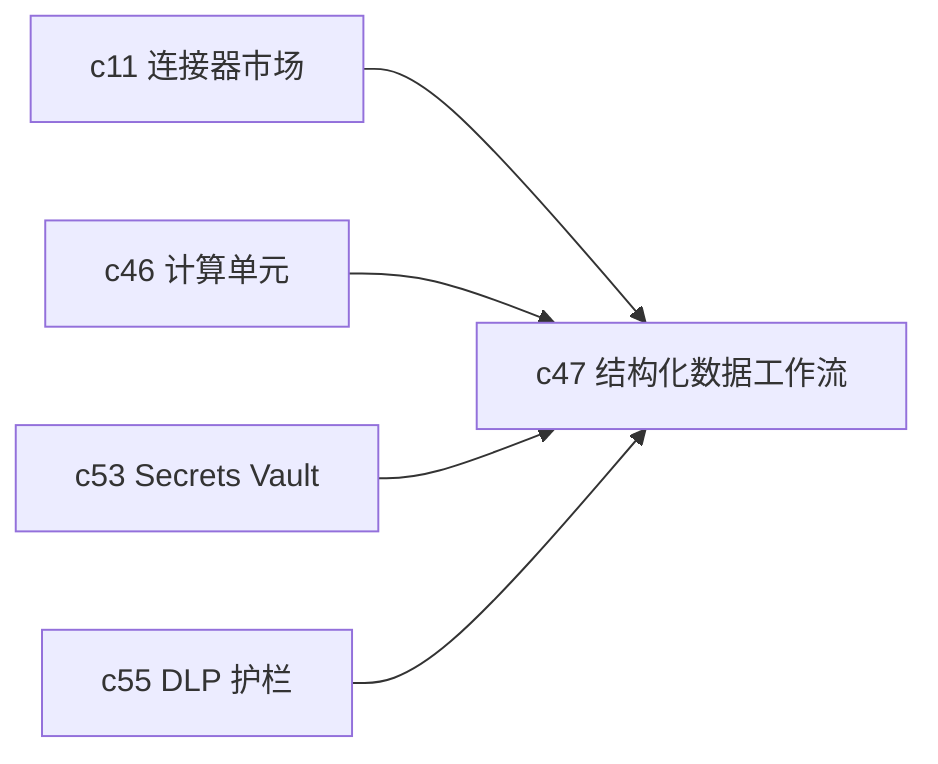

## Why

文档和网页只是知识来源的一半。很多团队真正重要的数据在数据库、数仓和 BI 系统里。没有结构化数据连接器，Crystalith 的研究能力会天然偏向“会写材料”，却不够擅长“会算事实”。

## What Changes

- 定义结构化数据连接器宿主语义，先覆盖表、视图、查询结果和字段元数据的最小公共词汇。
- 引入 SQL workflow，支持生成、审查、执行和结果回写，而不是直接把 SQL 当黑盒命令跑掉。
- 查询结果需要进入 Notebook 和后续生成链路，成为正式可引用对象。
- 凭据、权限、敏感字段和执行审计要从第一天就进提案，不后补。

## Capabilities

### New Capabilities

- `structured-data-connectors-and-sql-workflows`: 定义结构化数据接入、SQL 编排和结果回写语义。

### Modified Capabilities

- `connectors-sync-marketplace`: 需要支持数据库类连接器，而不只偏文档导入。
- `sandboxed-compute-cells-and-kernel-runtime`: SQL 结果需要能进入计算链路。
- `secrets-vault-and-credential-rotation`: 需要提供数据库凭据管理和轮换能力。
- `dlp-redaction-and-sensitive-data-guards`: 需要覆盖字段级敏感数据识别和放行策略。

## Impact

- Backend：需要结构化连接器接口、SQL 审核与执行编排、结果物化。
- Frontend：需要 schema 浏览、查询预览、风险提示和表格落地体验。
- Product：这条线会显著提高产品在分析型场景里的可信度和使用深度。

## Dependency Sketch

