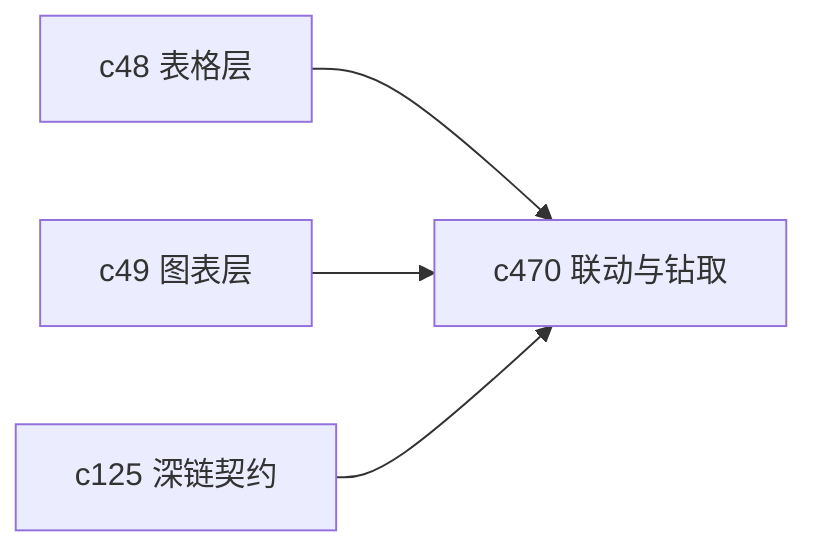

## Why

表格和图表如果各看各的，分析过程还是会断。用户真正想做的是在图里点到某个异常点，再顺着回到表格和来源。没有联动和钻取，图表层就只是更漂亮的截图。

## What Changes

- 定义 linked selection，让表格、图表和相关来源在选中状态上互相联动。
- 支持 drillthrough，让用户从图表点位回到表格行、来源片段或相关 notebook 块。
- 统一过滤、时间范围和局部聚焦，不让图表和表格各自记一套状态。
- 让联动结果可以进一步进入 briefing 或分析说明，而不是只停在当下交互。

## Capabilities

### New Capabilities
- `table-chart-linked-selections-and-drillthrough`: 定义表格图表联动、钻取和共享过滤语义。

### Modified Capabilities
- `table-view-dataframes-and-transformations`: 需要支持稳定的行标识与联动状态。
- `charts-dashboards-and-data-storytelling`: 需要支持联动和钻取入口。
- `cross-panel-selection-and-deep-link-contract`: 钻取动作需要落到统一定位规则上。

## Impact

- Backend：会影响表格结果标识、查询映射和钻取接口。
- Frontend：会影响图表交互、表格高亮和钻取跳转。
- Dependencies：这条线站在 `c48` 和 `c49` 上面，是数据表达层进入“可探索”状态的一步。

