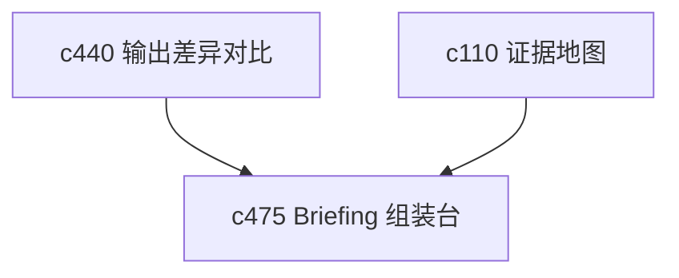

## Why

很多 briefing 不是一口气写出来的，而是边挑块、边钉证据、边排顺序。现在系统已经能生成 briefing，但还缺一个更像“组装台”的中间层，让用户能把值得保留的部分稳稳钉住。

## What Changes

- 定义 briefing assembly board，把关键段落、图表、结论和证据块先放到一个可整理的工作面上。
- 支持 evidence pinning，让用户把关键证据固定到 briefing 某个部分，而不是靠生成时碰巧带上。
- 允许从 notebook、output diff、来源片段和图表中挑选组件进入 briefing 组装。
- 让组装板和正式 briefing 之间保持清晰边界，避免半成品直接混进正式产物。

## Capabilities

### New Capabilities
- `briefing-assembly-board-and-evidence-pinning`: 定义 briefing 组装台、证据钉选和半成品边界。

### Modified Capabilities
- `publishable-artifacts`: 需要支持 briefing 从组装态进入正式产物。
- `output-draft-lifecycle-and-regeneration-safety`: 需要把 assembly board 视为正式草稿前态。
- `source-coverage-and-evidence-map`: 需要支持从证据地图直接钉选内容。

## Impact

- Backend：会影响组装对象、证据绑定和导出前状态流转。
- Frontend：会影响 briefing 编辑、拖放组装和证据固定交互。
- Dependencies：这条线接在 `c440` 和 `c110` 后面，是输出从“生成结果”走向“主动编排”的一步。

