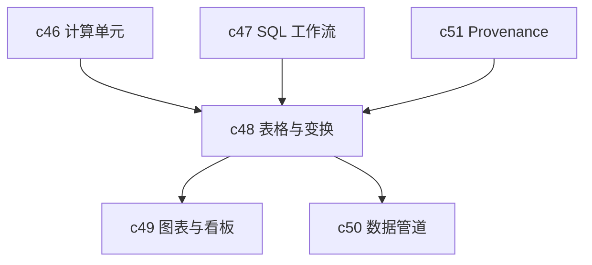

## Why

有了计算和 SQL 还不够，用户还需要一个能真正看、改、比的表格层。否则结果还是会被导到 Excel 或别的 BI 工具里，工作区就只完成了“拿到数据”，没有完成“在这里消化数据”。

## What Changes

- 引入正式的 table/dataframe 视图，支持过滤、排序、分组、采样和差异比较。
- 提供轻量 transformations，把常见清洗和衍生列操作做成可复用步骤。
- 表格结果需要能落为 Notebook block，并继续被图表、报告和导出复用。
- 让表格操作同样进入审计、复现和版本链路，而不是前端临时态。

## Capabilities

### New Capabilities

- `table-view-dataframes-and-transformations`: 定义表格视图、数据变换和结果沉淀语义。

### Modified Capabilities

- `sandboxed-compute-cells-and-kernel-runtime`: 计算结果需要稳定映射到 dataframe 视图。
- `structured-data-connectors-and-sql-workflows`: 查询结果需要进入统一表格层。
- `provenance-and-reproducible-runs`: 表格变换需要能被回放和比较。
- `workspace-ui-panels`: 需要新增针对表格对象的浏览和落地交互。

## Impact

- Backend：需要 dataframe 元数据、变换流水和结果快照。
- Frontend：需要高可用表格组件、差异视图和列级操作体验。
- Product：这是后续图表、dashboard 和数据管道能真正成立的中间层。

## Dependency Sketch

