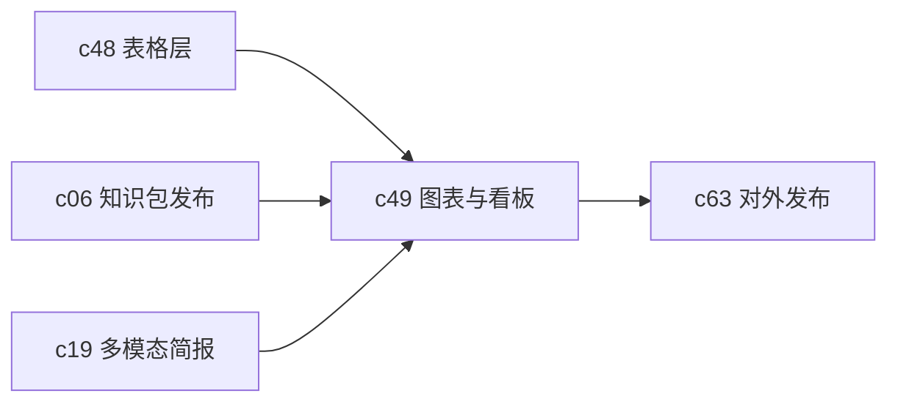

## Why

如果表格是事实层，图表和 dashboard 就是沟通层。现在产品能做报告、slides 和 briefings，但少了一块稳定的数据表达层。没有这层，很多本来应该一眼看懂的判断，最后还是会退回大段文字解释。

## What Changes

- 为 Notebook 和 workspace 引入正式的 chart block 和 dashboard 视图。
- 支持从表格结果生成常见图表，并保留查询、筛选和时间范围语义。
- 让图表进入发布、briefing 和 slides 链路，而不是单独做一套可视化孤岛。
- 定义图表刷新、失效和依赖上游数据变动的状态语义。

## Capabilities

### New Capabilities

- `charts-dashboards-and-data-storytelling`: 定义图表块、看板视图和数据表达语义。

### Modified Capabilities

- `table-view-dataframes-and-transformations`: 表格需要成为图表的正式上游。
- `publish-and-share-knowledge-packs`: 知识包需要稳定承载图表与 dashboard 摘要。
- `multimodal-audio-video-briefings`: 简报需要能消费图表结论，而不只是文本摘要。
- `studio-output-system`: studio 需要支持图表型产物编排。

## Impact

- Backend：需要图表配置持久化、刷新状态和依赖追踪。
- Frontend：需要图表渲染、交互过滤和 dashboard 编排体验。
- Product：这条线会明显提高产品在分析、汇报和对外展示场景里的说服力。

## Dependency Sketch

