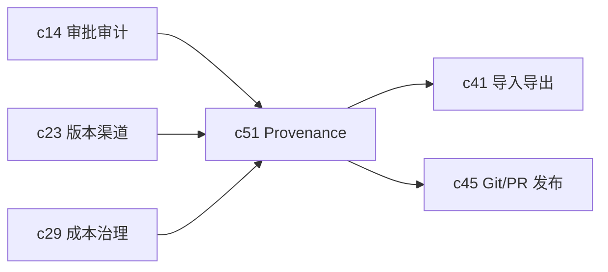

## Why

系统越强，越要能回答一句最朴素的话：这个结果到底是怎么来的。没有 provenance，版本只是编号，审计只是记录，信任中心也只能展示静态说明。真正进入团队和客户环境后，这个缺口会非常明显。

## What Changes

- 为 run、artifact、Notebook block、table 和 chart 定义统一 provenance 包，至少覆盖输入快照、模型摘要、工具调用、来源引用和生成时间。
- 支持 rerun 和 diff，让用户能比较同一输入在不同时间或不同配置下的结果差异。
- 让 provenance 默认进入导出、PR 发布、外部分享和审计材料，而不是手工附注。
- 把“可复现”作为正式产品语义，而不是工程内部习惯。

## Capabilities

### New Capabilities

- `provenance-and-reproducible-runs`: 定义结果来源链、回放和差异比较语义。

### Modified Capabilities

- `artifact-versioning-and-release-channels`: 版本需要能落到可解释的输入差异。
- `workspace-eval-center`: 评估中心需要引用同一份 provenance 数据。
- `customer-trust-center-and-audit-export-pack`: 对外审计包需要直接消费 provenance。
- `git-sync-and-pr-based-publishing`: PR 发布需要附带结果来源摘要。

## Impact

- Backend：需要 provenance 采集、存储、diff 和重跑编排。
- Frontend：需要来源链展示、差异视图和回放入口。
- Product：这是把“可信”从描述层推进到操作层的关键一环。

## Dependency Sketch

