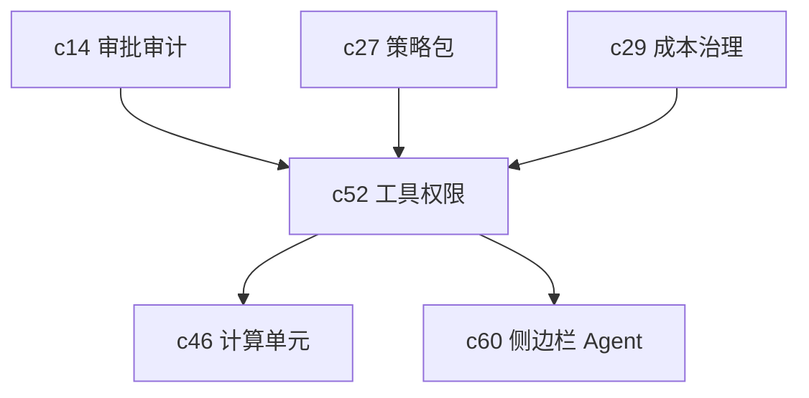

## Why

能力越像 agent，权限问题就越不能靠“提醒用户注意”来兜底。哪些工具能用，能访问哪些来源，什么时候需要审批提权，执行时能不能出网，这些边界不先写成产品契约，后面所有自动化都会带着隐患长大。

## What Changes

- 定义 agent 工具权限模型，覆盖工具级、对象级和动作级授权。
- 定义提权和临时授权语义，让敏感操作能进入审批链，而不是默认放开。
- 为执行环境补网络、文件系统、时间和并发等沙箱策略。
- 让权限与 workspace 对象状态、租户策略和环境策略连成一套，而不是零散配置项。

## Capabilities

### New Capabilities

- `agent-tool-permissions-and-sandbox-policy`: 定义 agent 工具授权、提权和沙箱边界。

### Modified Capabilities

- `approval-flows-and-audit-trails`: 需要支持提权申请和审批留痕。
- `policy-packs-and-environment-promotion`: 需要表达不同环境的工具与网络策略。
- `cost-intelligence-and-model-routing-governance`: 高成本或高风险工具需要进入统一治理。
- `sandboxed-compute-cells-and-kernel-runtime`: 计算执行需要直接消费这套策略。

## Impact

- Backend：需要权限求值、策略装配、执行前校验和审计记录。
- Frontend：需要风险提示、提权流程和权限可见性设计。
- Product：这是很多后续自动化提案能够落地的安全前提。

## Dependency Sketch

