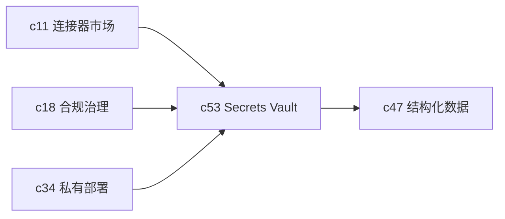

## Why

连接器、结构化数据源、Webhook、外部通知一多，凭据就会从“配置细节”变成“系统风险中心”。如果还是把密钥散在环境变量和人工文档里，迟早会在轮换、离职交接或私有部署时出问题。

## What Changes

- 引入正式的 secrets vault 语义，支持按 tenant、environment、connector scope 管理凭据。
- 定义凭据轮换、过期提醒、灰度切换和回滚流程。
- 让凭据使用记录进入审计链，能回答谁在什么时间用过哪一类凭据。
- 统一模型出口、数据库连接和第三方回调的凭据管理语义，避免每个能力单独长一套。

## Capabilities

### New Capabilities

- `secrets-vault-and-credential-rotation`: 定义敏感凭据的存储、轮换和审计语义。

### Modified Capabilities

- `connectors-sync-marketplace`: 连接器需要统一接入 Vault。
- `private-deployment-and-regional-data-plane`: 私有部署需要明确密钥托管边界。
- `compliance-retention-and-data-governance`: 凭据使用记录需要符合治理要求。
- `structured-data-connectors-and-sql-workflows`: 数据源连接需要直接消费 Vault 配置。

## Impact

- Backend：需要凭据引用、加密存储、轮换编排和审计记录。
- Frontend/Admin：需要凭据配置、健康状态和轮换流程界面。
- Product：这条线会直接影响企业部署和连接器规模化能力。

## Dependency Sketch

