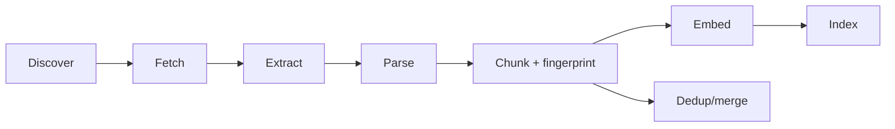

## Why

来源接得越多，inbox 就越容易变成“垃圾堆”：同一篇文章可能被导入两次、同一个文件换了路径就当成新 source、chunk 切分策略变动导致向量库一夜膨胀。检索质量会掉，存储也会涨，最后用户只剩一句话——“怎么越来越不好用了”。

把 ingestion 管线的契约、去重策略和 chunk 标准先收口，能让后面的检索、引用、评测都站在更干净的地面上。

## What Changes

- 定义 ingestion 的标准阶段与产物（以对象与状态驱动，不靠隐式约定）：
  - discover → fetch → extract → parse → chunk → embed → index
  - 每个阶段产出可追踪的 artifact（含来源与错误原因）
- 引入内容指纹（content fingerprint）作为去重基底：
  - source 级：同内容不同路径/不同 connector 的合并策略
  - chunk 级：chunking 策略变化时的再生成与迁移边界
- 收口 chunk 标准与元数据：
  - `chunk_index`、offset、provenance（来自哪个 extractor/parser）
  - 最小可用的 metadata（用于过滤、调试与引用）
- 明确增量更新策略：
  - source 更新/删除时，哪些 artifact 必须级联更新
  - 与向量库、缓存的失效策略如何对齐（连接 `retrieval-and-cache`）

## Capabilities

### New Capabilities

- `source-ingestion-dedup-and-chunking`: ingestion 阶段、内容指纹、去重与 chunk 标准契约。

### Modified Capabilities

- `source-ingestion-core`: ingestion pipeline 的阶段、状态与错误码约定。
- `source-connectors`: connector 输出的来源标识与变更检测（用于去重与增量）。
- `source-ingestion-upload-and-url`: 上传/URL 导入的指纹与更新语义。
- `source-ingestion-summary-and-conversion`: extractor/parser 的产物如何进入统一 artifact 模型。
- `retrieval-and-cache`: chunk/指纹变化时的缓存失效与索引更新策略。
- `data-and-storage`: ingestion 相关表结构、索引与保留策略（关联 `c18`）。

## Impact

- Backend：需要更明确的 artifact 记录与迁移边界；对长期检索质量与存储成本是正收益。
- Frontend：来源列表可以更“可信”：同一内容不会反复出现，也更容易解释“为什么没更新”。
- Dependencies：建议先对齐 `c08` 的对象/ID 约定，再把指纹与 artifact 建模落地。

## Dependency Sketch

