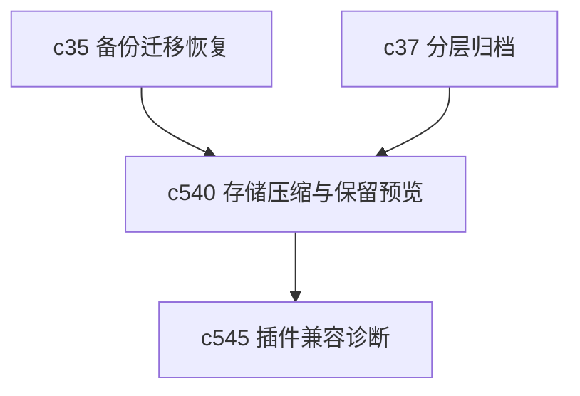

## Why

工作区对象一多，最先让人不舒服的通常不是“磁盘快满了”，而是越来越拖、越来越重，还不知道哪些东西还在占地方。存储问题如果一直停在后台脚本层，前面那些长期使用场景迟早会撞上墙。

## What Changes

- 定义 storage compaction，收口可安全压缩、可安全整理的对象范围。
- 增加 archive vacuum，让已归档或低频对象能进入更轻的存储形态。
- 提供 retention preview，在真正清理前告诉用户哪些对象会受影响、可回退边界在哪。
- 让存储整理不只是运维动作，而是用户能理解、能预估后果的工作区维护能力。

## Capabilities

### New Capabilities
- `storage-compaction-archive-vacuum-and-retention-preview`: 定义存储压缩、归档清理和保留预览语义。

### Modified Capabilities
- `tiered-archive-and-cold-storage-lifecycle`: 需要补实际整理动作与预览边界。
- `workspace-backup-migration-and-recovery`: 需要明确整理前后的恢复语义。
- `data-and-storage`: 需要表达对象冷热层和压缩策略。

## Impact

- Backend：会影响存储整理任务、冷热层迁移和预览计算。
- Frontend：会影响维护入口、预览说明和执行确认。
- Dependencies：这条线会和 `c37`、`c35` 接起来，也能减轻长时间使用后的性能压力。

