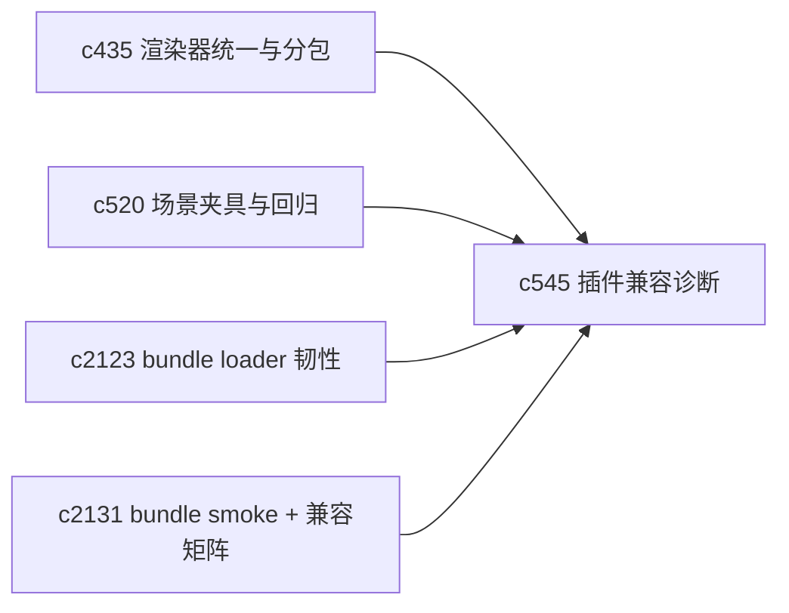

## Why

插件和渲染器一多，真正烦人的往往不是没有能力，而是“为什么这次没加载”“为什么这个 bundle 在这里能用、那里不能用”。如果注册表健康和兼容性诊断一直靠猜，扩展面越长越不稳。

## What Changes

- 定义 plugin registry health，收口插件发现、注册、启用和失败降级的状态词汇。
- 增加 compatibility diagnostics，让系统能解释插件为什么不可用，是版本不匹配、能力缺失还是资源没准备好。
- 区分宿主问题、插件自身问题和 bundle 加载问题，减少“反正就是没出来”的黑箱提示。
- 让诊断结果回流到输出渲染、插件管理和回归 harness，而不是只停在控制台。

## Capabilities

### New Capabilities
- `plugin-registry-health-and-compatibility-diagnostics`: 定义插件注册表健康、兼容性诊断和降级语义。

### Modified Capabilities
- `fullstack-plugin-bundles`: 需要补 bundle 级兼容性和失败原因表达。
- `official-plugins`: 官方插件需要声明可诊断的能力信息。
- `output-renderer-unification-and-plugin-bundle-splitting`: 渲染宿主需要消费兼容性结果。

## Impact

- Backend：若插件目录或能力声明在服务端参与装配，会影响目录接口与诊断字段。
- Frontend：会影响插件注册、按需加载、错误兜底和诊断面板。
- Dependencies：这条线承接 `c435`，也会和 `c520` 的场景回归形成互补；并建议把 frontend bundle 的失败状态机与 smoke tests 作为可落地的抓手（`c2123`/`c2131`）。

