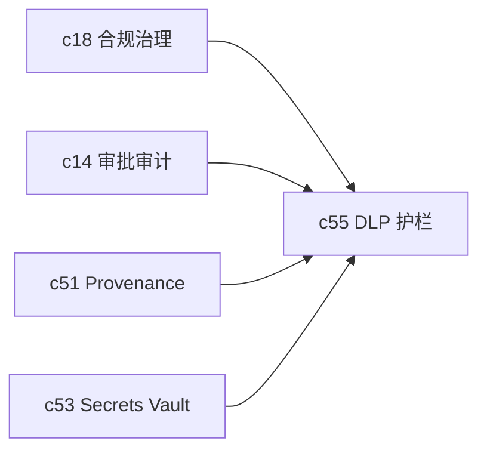

## Why

团队真正担心的，往往不是模型答得对不对，而是敏感内容会不会在导入、生成和外发的某一步漏出去。这个风险不进入正式产品设计，前面的分享、通知、结构化连接器和 agent 自动化都会被压着不敢放开。

## What Changes

- 引入 DLP 与脱敏护栏，覆盖导入前、生成前、外发前这几条关键路径。
- 支持基于规则、字段、标签和对象状态的敏感内容判定。
- 定义放行例外、人工审批和审计回写流程。
- 让敏感数据护栏和 provenance、权限策略、分享渠道共享同一套判断语义。

## Capabilities

### New Capabilities

- `dlp-redaction-and-sensitive-data-guards`: 定义敏感数据识别、脱敏和放行语义。

### Modified Capabilities

- `compliance-retention-and-data-governance`: 需要明确敏感数据的治理边界。
- `approval-flows-and-audit-trails`: 需要支持放行审批和例外记录。
- `external-share-portals`: 对外分享需要接入敏感数据判断。
- `provenance-and-reproducible-runs`: 需要记录哪条规则影响了结果流转。

## Impact

- Backend：需要 DLP 检查点、规则执行和放行记录。
- Frontend：需要风险提示、脱敏预览和审批入口。
- Product：这是对外分享、私有部署和结构化数据接入的共同保险丝。

## Dependency Sketch

