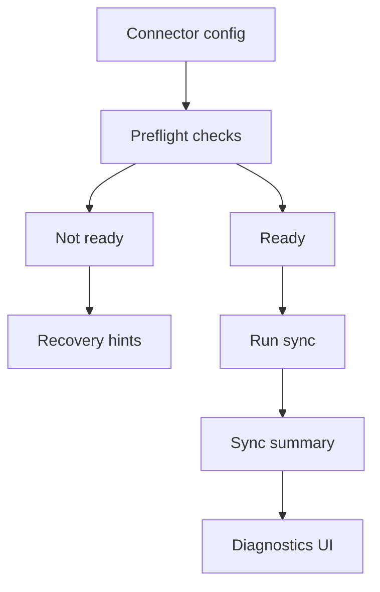

## Why

Connector 的失败体验目前太“工程化”：路径不对、权限不够、token 过期、服务不可达……这些问题用户自己就能修，但系统往往只给一个模糊错误。越是把 connector 当成常用入口，越需要把失败变得可解释、可恢复。

这份 change 聚焦在一个目标：让每个 connector 在“真正开始同步之前”就能给出可行动的诊断结果。

## What Changes

- 定义 connector preflight 契约（同步前自检）：
  - 配置校验（字段缺失/格式错误）
  - 连通性校验（endpoint/网络）
  - 权限校验（目录/授权范围）
  - 最小样本拉取（可选，避免“全量跑半小时才失败”）
- 把 preflight 结果做成用户可见的诊断视图：
  - 显示 status/reason/recovery_hint
  - 显示最近一次 sync 的摘要（成功多少、失败多少、失败原因分布）
- 与 plugin health 打通：connector 既是插件，也是 ingestion 入口，健康检查不要两套（引用 `c29`）。

## Capabilities

### New Capabilities

- `source-connector-preflight-and-diagnostics`: connector 自检、诊断视图与同步摘要的契约。

### Modified Capabilities

- `source-connectors`: connector 的 readiness 与错误码规范。
- `source-ingestion-management-and-tags`: sync 记录、失败原因与可视化要求。
- `official-plugins`: 官方 connector 必须提供 preflight（作为发布门禁之一）。
- `workspace-ui-panels`: connector 诊断入口与提示文案的最低要求（不再把用户赶去看日志）。

## Impact

- Backend：connector 接口需要输出更结构化的诊断结果；失败原因要能聚合。
- Frontend：来源管理页会更好用；用户能自己修复大多数问题。
- Dependencies：建议与 `c14` 的有效配置输出对齐（诊断里能解释“你现在用的是哪份配置”）。

## Dependency Sketch

