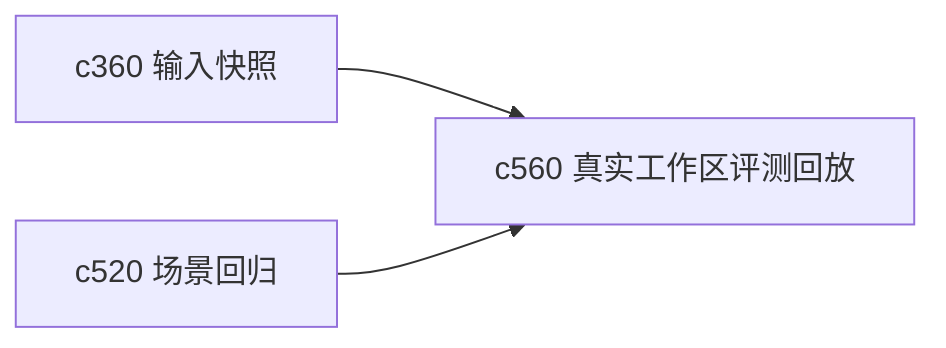

## Why

如果评测数据永远和真实工作区脱节，系统很容易在实验里看起来很好，用起来却老是碰壁。真正靠谱的 eval，不该只靠人工手写样例，也要能从真实使用里提取可回放的片段。

## What Changes

- 定义 real workspace eval capture，从真实工作区中抽取匿名化、可回放的评测片段。
- 支持 replay，让这些片段能在回归和模型对比里被重复使用。
- 区分仅供本地评测和可进入共享基线的数据，避免不该留存的内容混进长期数据集。
- 让捕获流程可解释、可筛选、可拒绝，不做“默认全收集”。

## Capabilities

### New Capabilities
- `real-workspace-eval-dataset-capture-and-replay`: 定义真实工作区评测片段采样、回放和边界控制。

### Modified Capabilities
- `quality-and-regression`: 需要支持真实场景评测集。
- `workspace-scenario-fixtures-and-regression-harness`: 需要消费真实片段回放。
- `run-input-snapshots-and-repro-packs`: 快照与复现包需要为评测集提供输入。

## Impact

- Backend：会影响评测数据抽取、匿名化和回放结构。
- Frontend：会影响评测片段选择、预览和确认入口。
- Dependencies：这条线接在 `c360` 和 `c520` 后面，是评测体系再往前迈一步。

