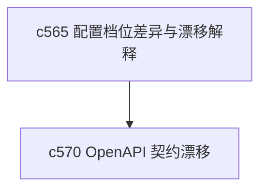

## Why

配置这件事最烦的地方，往往不是没有值，而是你不知道现在这套 profile 和上次到底差了什么。只要 profile、环境和运行模式开始变多，没有 drift explainer，很多问题都只能靠肉眼对比。

## What Changes

- 定义 config profile diff，让不同 profile 之间的关键差异可被直接查看。
- 增加 drift explainer，说明当前运行状态为什么和默认配置或预期 profile 有偏差。
- 区分静态配置差异和运行时推导差异，避免把两种问题混在一起。
- 让差异说明既服务调试，也服务部署前预检和配置回顾。

## Capabilities

### New Capabilities
- `config-profile-diff-and-drift-explainer`: 定义配置档位差异、漂移解释和预检语义。

### Modified Capabilities
- `config-and-models`: 需要提供更稳定的 profile 差异表达。
- `delivery-and-deployment`: 部署链路需要能消费漂移说明。
- `workspace-api-contract`: 若前台需要显示 profile 差异，需要补查询接口。

## Impact

- Backend：会影响配置解析、差异计算和预检输出。
- Frontend：会影响系统配置对话框和漂移说明视图。
- Dependencies：这条线和 `c570` 是一组，一个看配置漂移，一个看接口契约漂移。

