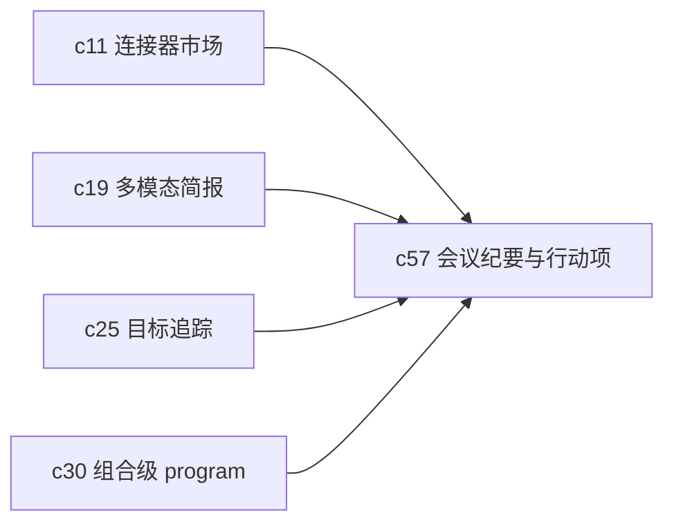

## Why

很多决策和待办并不是在正式文档里冒出来的，而是在会议里冒出来的。会后如果还得人工整理纪要、抄 action items，再塞回 Notebook 或 portfolio，信息就会断层。Crystalith 如果想更像工作中枢，这块迟早要补。

## What Changes

- 定义会议纪要、转写文本、行动项和责任人的对象语义。
- 支持把会议内容导入为可引用来源，并自动挂接到 Notebook、目标或 program。
- 让 action items 能触发后续 research run、审批或提醒，而不是停留在静态纪要里。
- 为音视频简报和移动采集补一条更贴近真实工作节奏的入口。

## Capabilities

### New Capabilities

- `meeting-notes-ingestion-and-action-items`: 定义会议内容接入、行动项抽取和后续挂接语义。

### Modified Capabilities

- `connectors-sync-marketplace`: 会议与日历类连接器需要纳入统一宿主。
- `multimodal-audio-video-briefings`: 会议音频和纪要要能进入统一摘要链路。
- `outcome-goals-and-impact-tracking`: 行动项需要能挂接目标和负责人。
- `portfolio-level-agent-programs`: program 需要能消费会议驱动的待办。

## Impact

- Backend：需要会议对象、行动项抽取和后续流程触发逻辑。
- Frontend：需要会议来源浏览、行动项编辑和挂接入口。
- Product：这条线会让系统更自然地接住组织里的“真实入口”。

## Dependency Sketch

