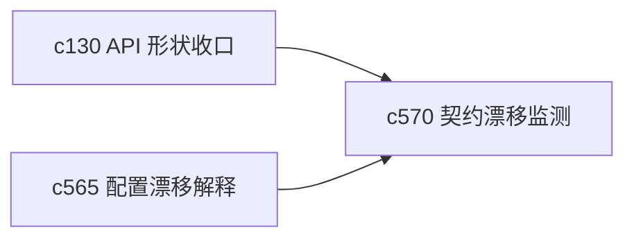

## Why

前端 generated client 一旦和后端接口悄悄漂开，问题往往不会立刻炸，而是变成很多低级的小裂缝。没有一层专门盯契约漂移，这种问题很容易积累到很难一起收。

## What Changes

- 定义 contract drift watch，持续检查 OpenAPI、生成客户端和前端实际消费之间的偏差。
- 区分 schema 变化、可选字段变化和命名漂移，避免所有差异都被算成同一种风险。
- 让 drift watch 的结果回流到生成客户端瘦身、回归 harness 和开发提示中。
- 支持在不阻塞全部开发的前提下，尽早暴露“这个接口快要不好维护了”的信号。

## Capabilities

### New Capabilities
- `openapi-client-contract-drift-watch`: 定义 OpenAPI 契约漂移监测、分级和反馈语义。

### Modified Capabilities
- `openapi-and-client-generation`: 需要接入漂移监测结果。
- `api-shape-consolidation-and-generated-client-slimming`: 需要消费漂移信号来收口接口形状。
- `quality-and-regression`: 契约漂移需要进入回归信号。

## Impact

- Backend：会影响 OpenAPI 生成检查和契约比对工具链。
- Frontend：会影响 generated client、类型层和开发提示。
- Dependencies：这条线是 `c130` 的继续深化，也和 `c565` 的配置漂移属于同一类维护信号。

