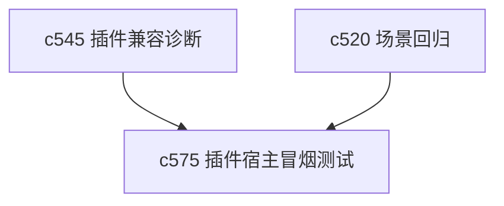

## Why

插件宿主最怕一种情况：看起来能注册，真跑时才发现缺能力、缺依赖或者加载顺序不对。没有主机级冒烟测试和就绪检查，插件兼容性诊断再清楚，也还是偏事后。

## What Changes

- 定义 plugin host smoke test，在宿主层预先检查关键能力是否可用。
- 增加 readiness check，覆盖插件加载、依赖能力、资源准备和错误兜底入口。
- 区分开发态问题、运行态问题和 bundle 问题，让失败定位更快。
- 让就绪检查既能在本地开发时跑，也能在回归 harness 里消费。

## Capabilities

### New Capabilities
- `plugin-host-smoke-tests-and-readiness-checks`: 定义插件宿主冒烟测试、就绪检查和分层失败语义。

### Modified Capabilities
- `plugin-registry-health-and-compatibility-diagnostics`: 需要把事后诊断延伸到事前检查。
- `workspace-scenario-fixtures-and-regression-harness`: 需要支持插件宿主冒烟场景。
- `fullstack-plugin-bundles`: 需要暴露可测试的宿主依赖与 bundle 能力边界。

## Impact

- Backend：如宿主部分在服务端参与装配，会影响准备检查接口。
- Frontend：会影响插件加载前检查、开发态提示和诊断面板。
- Dependencies：这条线接在 `c545` 后面，是“先发现问题，再加载”的那层。

