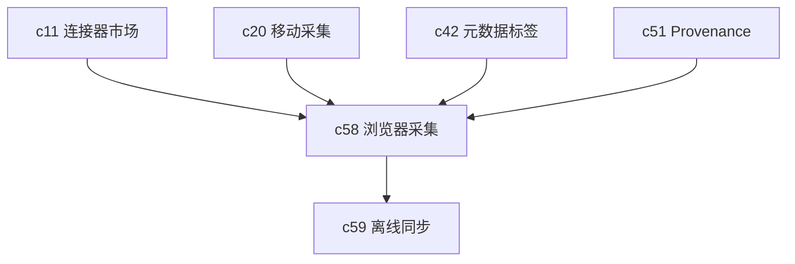

## Why

移动采集是一条入口，浏览器一键采集是另一条入口，而且通常更高频。很多来源不是通过正式连接器进来的，而是用户在阅读时顺手保存的。如果没有 clipper，来源接入会显得“完整，但不顺手”。

## What Changes

- 定义浏览器采集对象，支持整页、选区、截图和关键元数据。
- 采集内容进入正式来源链路，保留 URL、采集时间、标签和可选的 DOM 摘要。
- 支持快速落到当前 Notebook 或稍后归档，不强迫用户当场做完整整理。
- 为后续离线同步、引用定位和来源健康跟踪提供统一入口。

## Capabilities

### New Capabilities

- `browser-clipper-and-web-capture`: 定义浏览器采集、网页摘要和来源落地语义。

### Modified Capabilities

- `connectors-sync-marketplace`: 需要支持浏览器采集类入口。
- `mobile-capture-and-review-mode`: 两类轻采集入口需要共享对象语义。
- `workspace-metadata-tags-and-discovery`: 采集内容需要带标签和归档信息。
- `provenance-and-reproducible-runs`: 采集来源需要保留可回查元数据。

## Impact

- Backend：需要网页采集对象、轻量入库和引用定位摘要。
- Frontend/Extension：需要浏览器扩展、快速保存和稍后整理体验。
- Product：这是把来源接入门槛再往下压的一条高频入口。

## Dependency Sketch

