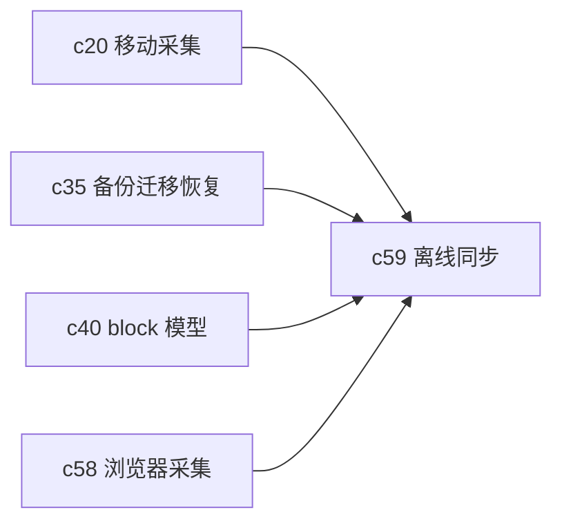

## Why

一旦移动采集、浏览器采集和 Notebook 编辑都开始变重，离线与冲突就不是可选题了。现在不把同步模型先写清楚，后面会出现同一个对象在多端各改一版，最后只能靠人工猜哪个是新的。

## What Changes

- 定义 local-first 对象缓存与增量同步语义，让核心工作区对象支持先本地落地再异步同步。
- 引入 block 级冲突检测和合并策略，必要时进入审阅或人工决议。
- 把同步日志和恢复能力接到备份、迁移和移动采集链路里。
- 明确哪些对象允许离线创建，哪些对象只能在线确认，以避免伪一致性。

## Capabilities

### New Capabilities

- `local-first-offline-sync-and-conflict-resolution`: 定义多端缓存、同步和冲突处理语义。

### Modified Capabilities

- `mobile-capture-and-review-mode`: 移动端需要共享同一套离线模型。
- `workspace-backup-migration-and-recovery`: 需要消费同步日志和本地快照语义。
- `notebook-content-model-and-block-editor`: 冲突合并要落到 block 粒度。
- `multiplayer-review-workspace`: 多人协作需要与离线冲突策略兼容。

## Impact

- Backend：需要同步游标、变更日志、冲突检测和恢复接口。
- Frontend/Mobile：需要本地缓存、同步状态和冲突解决交互。
- Product：这是多端体验从“能打开”走向“真能用”的分水岭。

## Dependency Sketch

