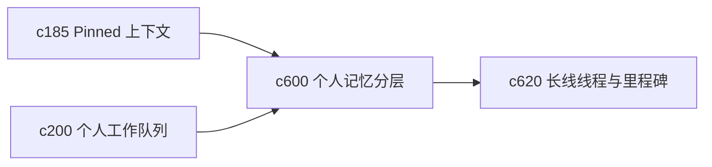

## Why

个人长期使用时，真正容易丢的不是文件，而是“当时为什么这么看、下一次该从哪里接上”。现在已经有最近上下文、Pinned、队列和回访机制，但它们更多照顾短周期操作，还缺一个更稳定的个人记忆层。

## What Changes

- 定义 personal memory layer，把近期热记忆、中期工作记忆和冷存档记忆分成不同回看面。
- 增加 recall view，允许按主题、对象、时间段和上次停下的位置回看工作轨迹。
- 支持把 note、source、run、output、decision 组织成可重返的记忆片段，而不是只靠最近列表。
- 让 resurfacing、pin、snooze 和 archive 能落到统一记忆语义上。

## Capabilities

### New Capabilities
- `personal-memory-layers-and-recall-views`: 定义个人记忆分层、回看视图和记忆片段重返入口。

### Modified Capabilities
- `workspace-state-projection-and-summary-cache`: 需要提供记忆层摘要与回看入口。
- `pinned-work-contexts-and-scratchpads`: 需要接入长期记忆层，而不只是一组静态置顶对象。
- `personal-work-queues-and-review-buckets`: 需要和记忆分层互通，区分“待做”与“值得记住”。

## Impact

- Backend：会影响工作区对象索引、时间线聚合和记忆层投影。
- Frontend：会影响首页、回看页、对象详情和长期上下文切换。
- Dependencies：这条线承接 `c185`、`c200`，也会给 `c620` 提供更稳定的长期线程入口。

