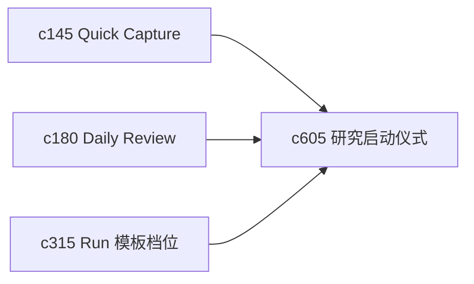

## Why

很多个人研究工作并不难，难的是每次开始前都要重新想一遍：先收哪些来源、先跑哪类检索、先不要碰什么。没有一个轻量的启动仪式，工作会反复在起步阶段耗散。

## What Changes

- 定义 research ritual preset，把“晨间回看”“新主题摸底”“来源补证”“最终成稿前复核”这类启动套路沉淀成可复用预设。
- 增加 startup checklist，让用户在进入 run 或编辑前先看到一组明确的起步步骤。
- 支持 ritual preset 和 queue、saved search、run template 串起来，形成一键开场。
- 让 checklist 既能自动生成，也能被用户手动精简，不把个人流程写死。

## Capabilities

### New Capabilities
- `research-ritual-presets-and-startup-checklists`: 定义个人研究启动预设、检查单和开场动作编排。

### Modified Capabilities
- `quick-capture-inbox-and-triage-flow`: 需要能把 inbox 清理动作接入启动检查单。
- `daily-review-resurfacing-and-deferred-items`: 需要支持“今天先做哪种 ritual”的入口。
- `run-template-profiles-and-resume-defaults`: 需要能被 ritual preset 引用，而不是孤立存在。

## Impact

- Backend：会影响预设存储、检查单生成和动作装配接口。
- Frontend：会影响首页入口、启动弹层和队列页引导。
- Dependencies：这条线和 `c145`、`c180`、`c315` 是同一条个人操作面收口链路。

