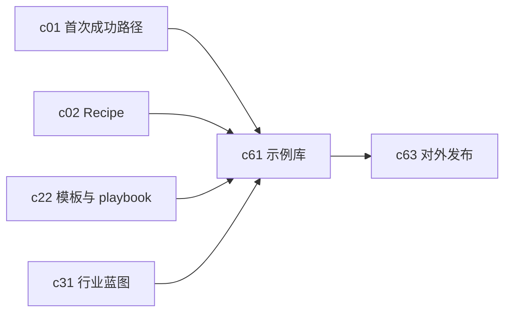

## Why

产品进入公开试用或团队扩张阶段后，最有效的 onboarding 往往不是“看文档”，而是“先复制一个能跑的东西”。前面已经有模板、playbook 和行业包方向，但还缺一个真正面向使用者的示例库入口。

## What Changes

- 建立官方示例库，覆盖任务型、角色型和行业型样板工作区。
- 每个样板都带 playbook、推荐数据、预置输出和可裁剪的起步路径。
- 支持一键复制到个人或团队工作区，而不是只提供静态截图和说明文档。
- 让示例库和模板体系、行业方案、首次成功路径连成一条上手链路。

## Capabilities

### New Capabilities

- `example-gallery-and-sample-workspaces`: 定义示例工作区、样板复制和官方样板管理语义。

### Modified Capabilities

- `first-run-success-path`: 首次成功路径需要能直接落到示例库。
- `recipe-driven-workflows`: 样板要能附带可执行 workflow。
- `workspace-templates-and-operating-playbooks`: 模板与样板需要共享结构但职责不同。
- `domain-blueprints-and-industry-packs`: 行业包需要能在示例库中被消费。

## Impact

- Backend：需要样板存储、复制流程和版本管理。
- Frontend：需要示例浏览、预览、筛选和一键启用入口。
- Product：这条线会直接影响公开试用转化和团队内部扩散速度。

## Dependency Sketch

