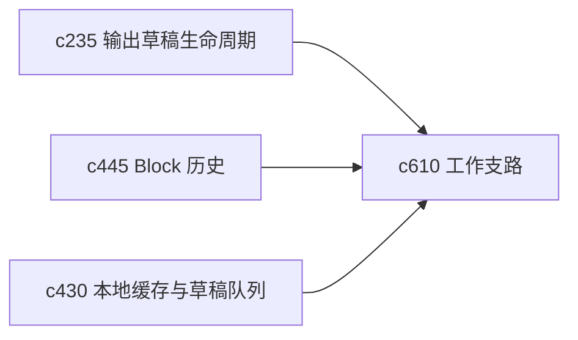

## Why

个人研究里经常会出现“我想试一下另一条思路，但又不想把当前工作面弄乱”。如果没有安全试验支路，用户就会在同一个 notebook、同一组 source 和同一次生成里反复覆盖，最后很难回头。

## What Changes

- 定义 workspace exploration lane，让同一主题下可以开出轻量支路来试不同结构、不同来源组合或不同生成策略。
- 支持从 notebook、output、source pack 和 run state 快速派生 branch，而不是整份复制工作区。
- 增加 merge back / discard 语义，让支路结果能选择性回流主线。
- 明确 branch 只服务个人试验和安全回退，不引入多人协作语义。

## Capabilities

### New Capabilities
- `workspace-branching-and-safe-exploration-lanes`: 定义个人工作支路、派生方式和回流规则。

### Modified Capabilities
- `output-draft-lifecycle-and-regeneration-safety`: 草稿需要支持从稳定版本分出试验支路。
- `notebook-block-history-and-undo-checkpoints`: 区块历史需要能表达支路来源。
- `local-cache-draft-queue-and-sync-preflight`: 本地草稿与同步预检需要识别支路对象。

## Impact

- Backend：会影响对象 lineage、分支索引和局部回流规则。
- Frontend：会影响 notebook、output 详情页和支路切换入口。
- Dependencies：这条线建立在 `c235`、`c445`、`c430` 上，也给后续输出实验和长线线程提供安全试错底座。

