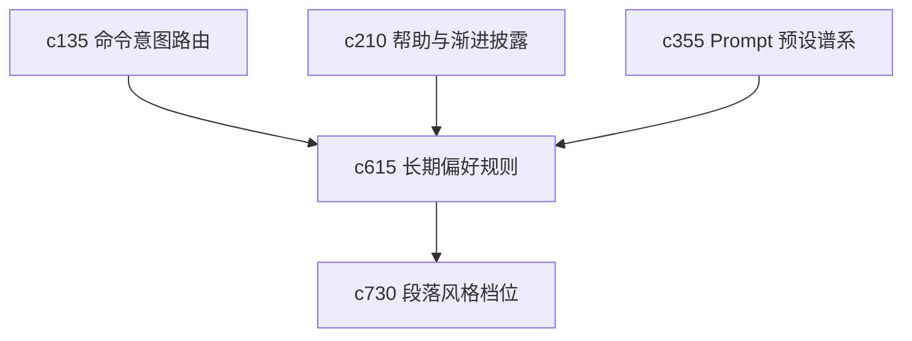

## Why

个人产品用久了，真正值钱的是那些“不用再说第二遍”的偏好：我更喜欢先看证据再看结论、我不要太花的措辞、我希望默认保守一些。现在这些偏好还散在 prompt、preset 和临时操作里，不够稳。

## What Changes

- 定义 durable user rule，把个人偏好收成长期有效的 steering contract。
- 区分风格偏好、操作偏好和安全偏好，避免所有偏好混成一个黑盒 preset。
- 让用户规则能作用到 command routing、run preset、output template 和帮助提示，而不是只作用在生成阶段。
- 增加规则可见性，明确哪些行为来自系统默认，哪些来自用户长期偏好。

## Capabilities

### New Capabilities
- `steering-preferences-and-durable-user-rules`: 定义用户长期偏好、作用域和规则解释面。

### Modified Capabilities
- `command-intent-routing-and-action-composition`: 路由层需要读取用户长期偏好。
- `prompt-preset-lineage-and-migration`: 预设谱系需要区分系统模板与用户规则叠加。
- `contextual-help-overlays-and-progressive-disclosure`: 帮助提示需要能解释当前行为受哪些规则影响。

## Impact

- Backend：会影响偏好存储、路由入参和规则叠加顺序。
- Frontend：会影响设置面板、提示解释和行为来源展示。
- Dependencies：这条线承接 `c135`、`c210`、`c355`，也会给 `c730` 这类表达约束能力提供统一入口。

