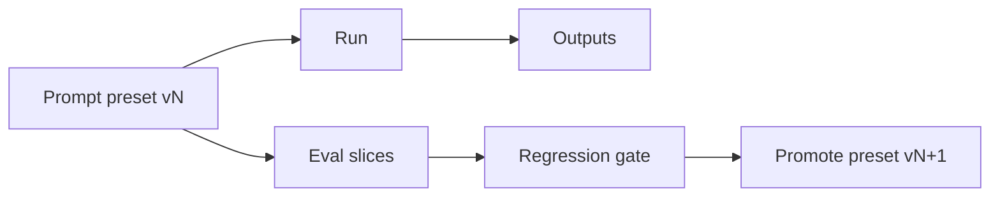

## Why

Prompt preset 是系统行为的隐形方向盘：同一个输入，换一个 preset 或改一句 system prompt，输出就可能完全不同。现在 preset 更像“配置项”，但它的演进缺少可追溯性与迁移边界，导致改动风险很难评估。

我们需要把 preset 从“随手改的文本”升级成“有谱系、有版本、有回归保护”的资产。

## What Changes

- 为 prompt presets 引入 lineage 与版本概念：
  - `preset_id`（稳定标识）+ `version`（递增）
  - deprecate/replace 关系（老 preset 指向新 preset）
- 为每次 preset 变更附带迁移提示：
  - 哪些输出会变、为什么会变、推荐如何验证
  - 与 `c27` 的 eval scorecard/样本绑定（至少提供一组“改前/改后”的回归对比）
- 在 run/output 上记录“使用了哪个 preset 版本”：
  - 让 bug 讨论不再停留在“我觉得你改过提示词”，而是能对齐到版本号
- 提供安全护栏：
  - preset 缺失/被禁用时的 fallback 规则（避免运行时直接炸）

## Capabilities

### New Capabilities

- `prompt-preset-lineage-and-migration`: preset 的谱系、版本、迁移提示与回归绑定契约。

### Modified Capabilities

- `chat-prompt-presets`: preset 的数据模型、启停语义与版本规则。
- `generation-presets-and-constraints`: preset 如何影响生成约束与输出形态。
- `quality-and-regression`: preset 改动进入回归体系的最低要求（引用 `c27`/`c28`）。
- `workspace-api-contract`: run/output 返回 preset 版本信息，便于前端展示与排障。

## Impact

- Backend：需要把 preset 变更记录得更“像版本控制”，并让 run/output 可追溯。
- Frontend：对用户不一定要暴露全部细节，但至少要能在 debug/diagnostics 里看到版本。
- Dependencies：建议与 `c27` 的评测闭环一起推进，否则版本化只是“更好地不知道自己改坏了什么”。

## Dependency Sketch

