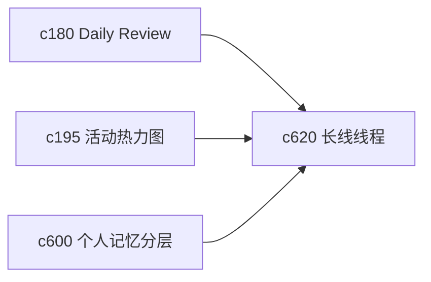

## Why

很多主题不是一天做完的。用户会在几周甚至几个月里反复补来源、改结构、换结论。如果没有“长线线程”这个视角，系统再多短期提醒也很难帮助用户看清整体推进到了哪里。

## What Changes

- 定义 long-arc thread，把同一主题下跨多次 session、run、notebook 和 output 的推进过程串成一条长线。
- 增加 milestone checkpoint，用更轻的方式记录“已形成判断”“还缺哪类证据”“下次从哪里接着做”。
- 支持 dormant thread 的轻量归档与定期浮现，减少长期主题失联。
- 让 heatmap、review bucket 和记忆层都能挂到长线线程上，而不是各自孤立。

## Capabilities

### New Capabilities
- `long-arc-threads-and-milestone-checkpoints`: 定义长期主题线程、阶段里程碑和沉睡主题重返规则。

### Modified Capabilities
- `daily-review-resurfacing-and-deferred-items`: 需要支持长线主题的周期回访。
- `workspace-activity-heatmap-and-routine-loops`: 活动热力图需要能切到主题线程视角。
- `personal-memory-layers-and-recall-views`: 记忆层需要提供线程级回看入口。

## Impact

- Backend：会影响主题聚合、里程碑状态和长期线程索引。
- Frontend：会影响主题首页、复盘面板和下次继续入口。
- Dependencies：这条线接在 `c180`、`c195`、`c600` 后面，是个人长期使用价值感的重要补件。

