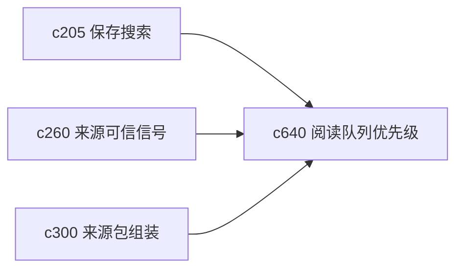

## Why

来源一多，真正的问题不再是“有没有资料”，而是“先读哪份最划算”。如果所有来源都平铺在列表里，用户很容易把时间花在信息密度低、重复度高或暂时不关键的内容上。

## What Changes

- 定义 reading queue prioritization，根据主题、缺口、可信度和重复风险给出阅读顺序建议。
- 增加 guided order，区分“先建立全貌”“先补关键缺口”“先验证争议点”这几种阅读路径。
- 让用户能手动调序、跳过和标记已消化，避免自动排序压过个人判断。
- 支持把阅读队列与 source pack、saved search 和 evidence gap 互通。

## Capabilities

### New Capabilities
- `reading-queue-prioritization-and-guided-order`: 定义来源阅读优先级、推荐顺序和消化状态。

### Modified Capabilities
- `saved-searches-smart-filters-and-follow-lists`: 保存搜索需要能直接进入阅读队列。
- `source-trust-signals-and-quality-hints`: 可信信号需要参与阅读优先级。
- `source-pack-assembly-and-topic-watchlists`: 来源包需要能生成面向阅读的顺序视图。

## Impact

- Backend：会影响来源打分、队列生成和消化状态记录。
- Frontend：会影响来源列表、阅读面板和“下一份该看什么”提示。
- Dependencies：这条线会把 `c205`、`c260`、`c300` 串成真正可操作的阅读工作面。

