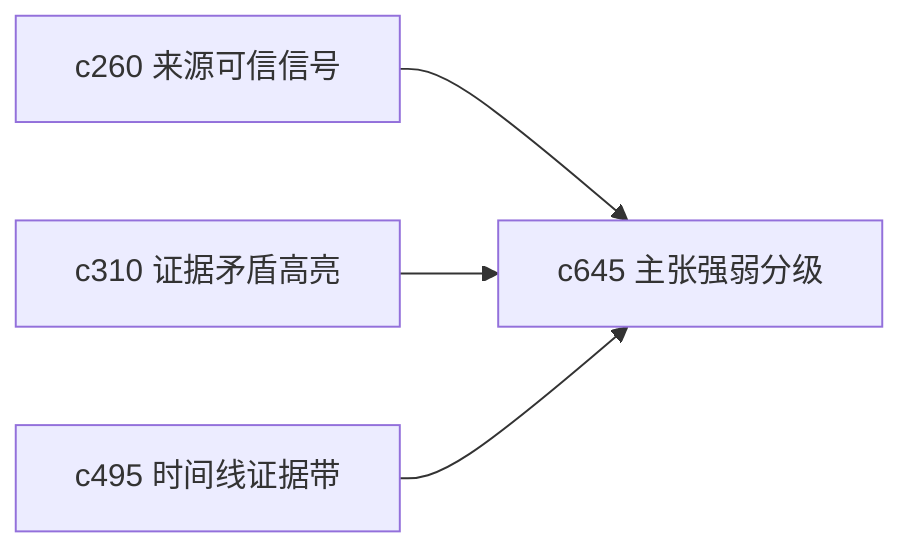

## Why

“有引用”不等于“论点就稳”。个人做研究时最需要的是对主张强弱有更细的体感，知道哪些结论只是初步判断，哪些已经有足够支撑。现在系统对证据分量表达还不够直接。

## What Changes

- 定义 claim strength grading，把结论按证据重量、来源独立性和反例压力分层展示。
- 增加 evidence weight，让用户知道某条判断是“单点强证据”还是“多点弱共识”。
- 支持把证据强弱带回 notebook、briefing 和 output review，而不是只停在来源详情。
- 区分“证据不足”“证据矛盾”“证据陈旧”这几类弱点，避免一概而论。

## Capabilities

### New Capabilities
- `claim-strength-grading-and-evidence-weight`: 定义主张强弱分层、证据权重和弱点类型。

### Modified Capabilities
- `source-trust-signals-and-quality-hints`: 来源可信度需要成为证据权重的一部分。
- `evidence-contradiction-highlights-and-resolution-notes`: 矛盾处置需要反馈到主张强弱。
- `timeline-evidence-bands-and-source-drillback`: 时间带视图需要展示判断强弱随时间的变化。

## Impact

- Backend：会影响证据聚合、评分字段和主张摘要接口。
- Frontend：会影响引用提示、结论卡片和证据说明层。
- Dependencies：这条线和 `c260`、`c310`、`c495` 一起，把“证据感”从后台逻辑拉到用户可见层。

