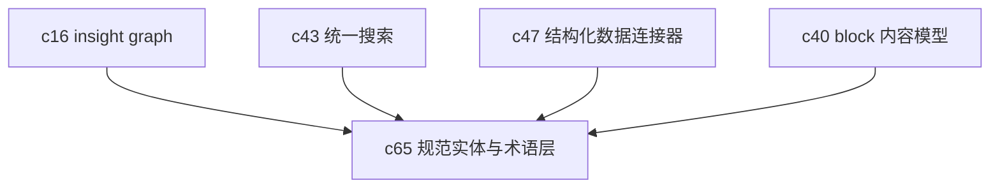

## Why

项目越往后走，真正难管的往往不是文档块本身，而是"同一个东西到底叫什么"。公司别名、产品线简称、人物身份、指标口径如果一直靠临时字符串拼出来，检索、复用和洞察沉淀迟早会开始打架。`c16` 已经在讲 insight graph，但还没有把最容易反复出问题的实体和术语先钉成稳定底座。

## What Changes

- 引入 canonical entity 和 glossary term 两类正式对象，统一承接别名、说明、上下位关系和来源锚点。
- 支持从来源、Notebook block、structured data 和 insight 中抽取候选实体，并提供 merge / split / disambiguation 流程。
- 让搜索、引用、比较和生成能够优先围绕 canonical id 工作，而不是每次重新猜测同义词。
- 为高价值术语补定义、适用范围和口径说明，减少跨团队协作时的概念漂移。
- 把这条线定位成 insight graph 的语义地基，而不是再造一个新的图谱产品面。

## Capabilities

### New Capabilities

- `canonical-entities-and-semantic-resolution`: 定义实体注册表、术语表、别名解析、消歧和稳定语义引用能力。

### Modified Capabilities

- `insight-graph-and-memory`: 需要把 entity 节点与 canonical entity 对齐，而不是继续使用松散命名。
- `unified-search-query-and-rerank`: 需要支持实体别名扩展、口径提示和按 canonical id 聚合结果。
- `structured-data-connectors-and-sql-workflows`: 需要支持字段到实体/术语的映射，避免结构化数据和文本侧各说各话。
- `notebook-content-model-and-block-editor`: 需要支持 block 级实体链接、术语提示和引用回跳。
- `retrieval-and-cache`: 需要增加实体感知检索和实体级缓存键语义。

## Impact

- Backend：需要新增实体与术语对象、别名解析、消歧流水线和引用关系存储。
- Frontend：需要补实体卡片、术语提示、候选合并界面和冲突处理入口。
- Product：这条线能把"长期认知资产"从结果层再往下压一层，后面做搜索、图谱、structured data、scenario 都会更稳。
- Dependencies：建议接在 `c16-cross-notebook-insight-graph`、`c43-unified-search-query-and-rerank`、`c47-structured-data-connectors-and-sql-workflows`、`c40-notebook-content-model-and-block-editor` 之后。

## Dependency Sketch

